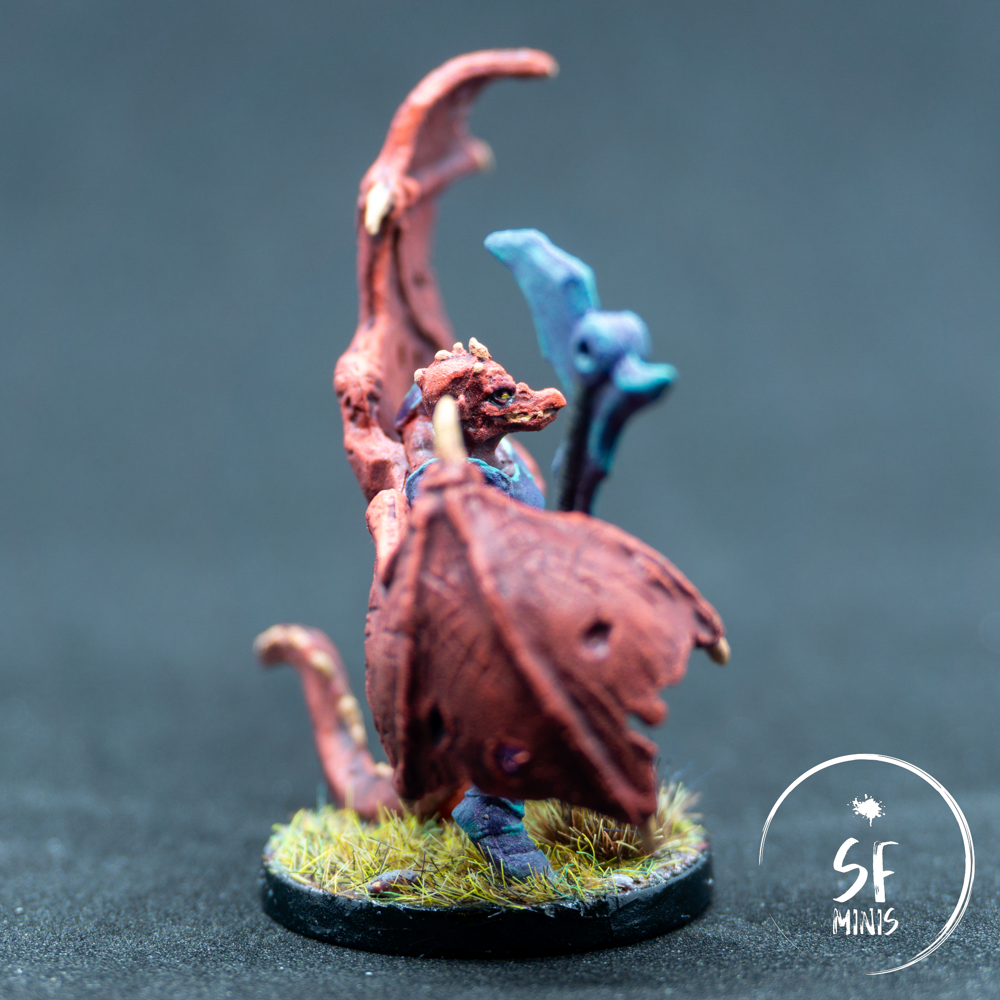
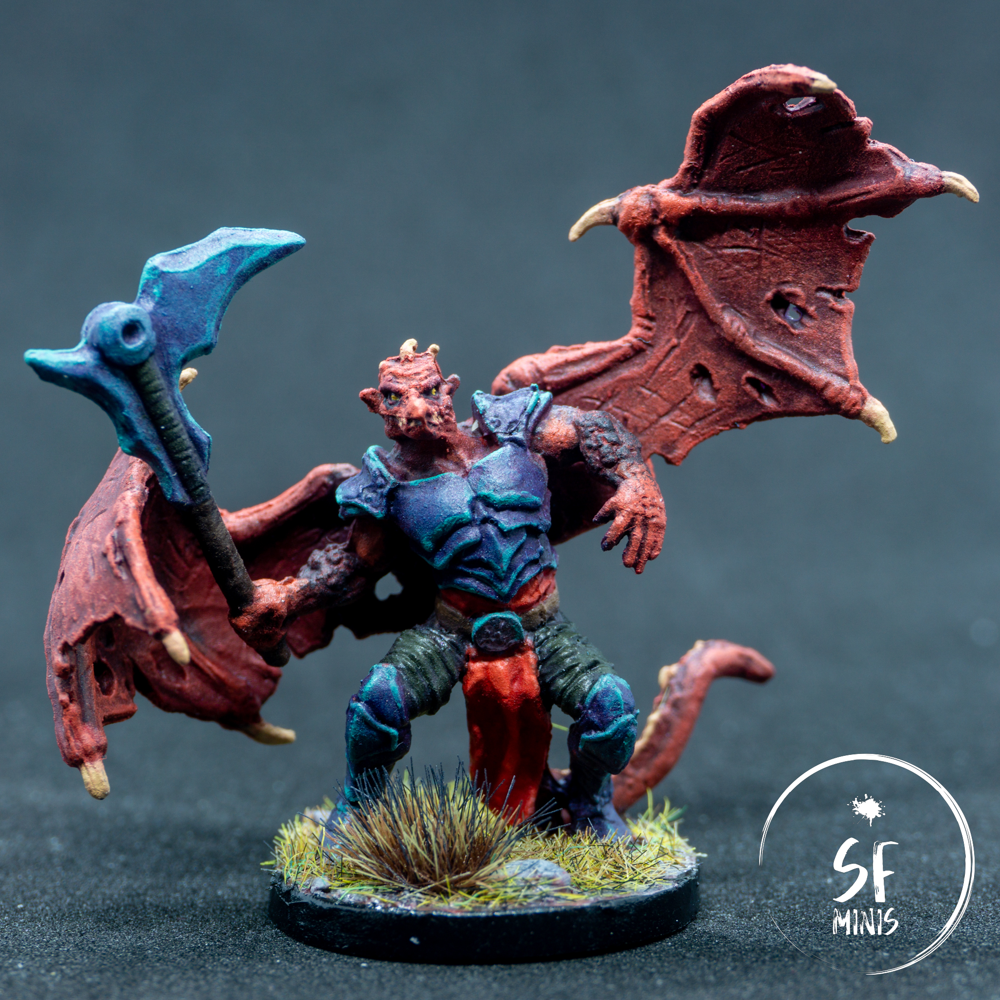

I painted Belthir a few weeks ago, and so far it has been the most satisfying paint job I've done. It went from a near-failed experiment, to something that I am really proud to showcase and look at, and most important of all I spent probably the least amount of time on it than I have on any other mini or group.

---

Starting off with the skin colour, I didn't want it to be too bright, but not too dull either. It was surprisingly hard to find some reference images for these colours, and the few that there were had very different palettes: some were quite flashy, with high contrasts and saturations, while others were frankly uninspiring and didn't really do a good job at showcasing the sculpt (which, aside from the weird pose, is actually pretty nice.)

In the end, I decided to take the best of both worlds, and go with a colour that would still look good but not burn the viewers' retinas. I basecoated the skin with a medium-dark red and gave it a quick wash with some mid tone - and the effect was already striking! Somehow it pooled well in the right places and left some of the raised areas alone. I rarely have such a good effect from the wash alone on the first try, and this was the case.

After that, it was all quite straightforward and basic - highlighting the raised, bony parts of the wings, a bit of glazing to further darken some of the recesses that were not hit by the light, and then further layering the parts exposed to the light such as face, head and stretched wing skin. Close it off with some brown and beige on the bones, and this was done, easy peasy.

---

Then I got to the armor. Initially, I was thinking of trying out non-metallic metal, but after being really satisfied with how the skin had turned out I didn't want to risk ruining a good paint job, so I deferred that to a future, less important project. I still wasn't sure how I could pull off the kind of opalescent look that was showing in the reference images.

I started off by creating a slightly purple shade of metallic paint, but that was looking extremely dull on its own. So I threw some extra purple wash on it, and it started to come alive more; however it was still not the way I was picturing it. At that point, I simply started to lightly dry-brush it with a teal colour and, to my surprise, that did most of the trick: it retained the metallic luminescence below, and still gave it some quirky lighting that was necessary to achieve that opalescent look I was seeking. The last step was just a quick (in some places, admittedly TOO quick) edge highlight and there it was, a look I was really proud of. And all with really little effort!

---

Lastly, I just finished off the smaller details, like the red cloth (I think I have painted more red cloth this past year than any other colour combined, so I'm now becoming ever more confident with glazing this hue) and the - purposefully - dull dark gray wraps on the legs. Then basing, varnishing and done - ready to be showcased!

Hopefully you will have learned something too from this story - that even if it seems a bit daunting at first, it's always a good idea to try, not to be afraid to fail. Worst that can happen, you end up with a slightly disappointing mini; but if you keep at it and try to improve every time, you will see the results and be prouder and prouder of your work.

As always, thank you for reading! See you with the next paint job soon!
