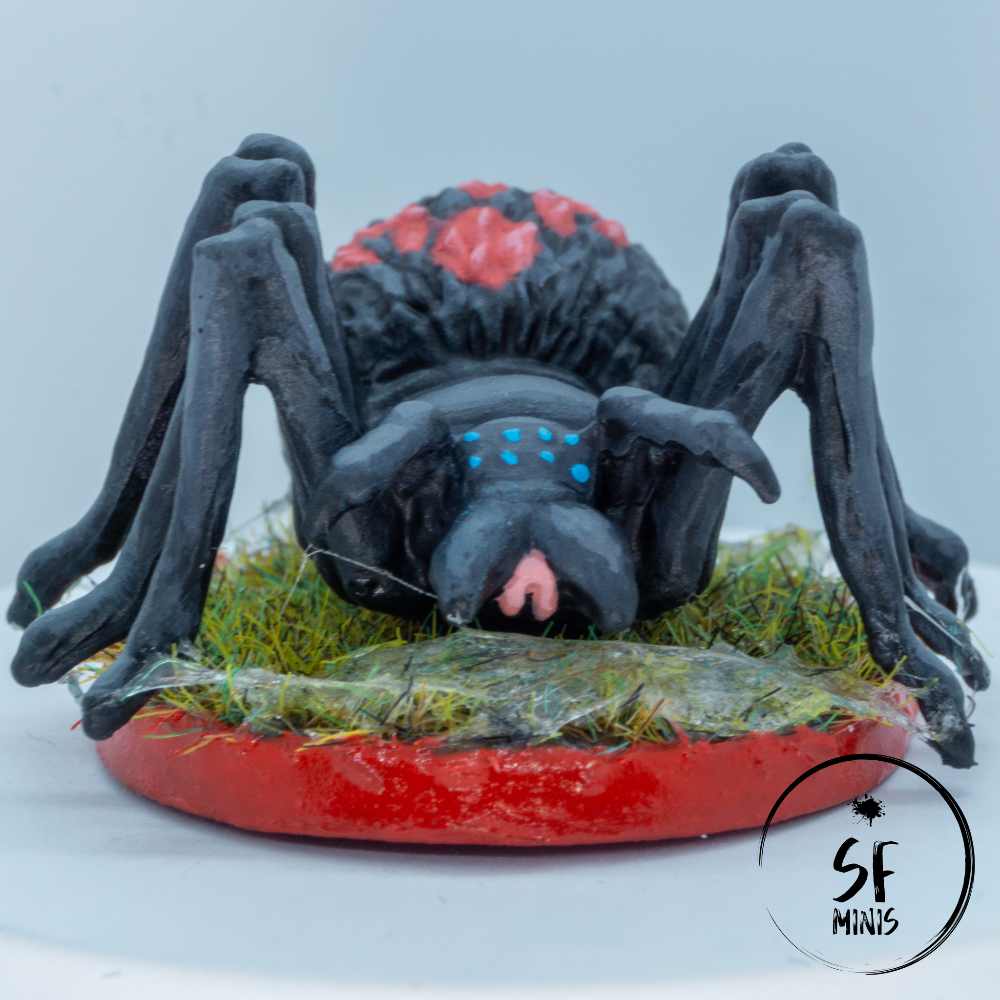

This week, to bounce back from the relative disappointment of the Striders, I decided to paint some miniatures I was not too attached to. I didn't want to spend ages thinking about the colour scheme, or hours blending colours to perfection; I just wanted to get some painting done on a group of miniatures that comes up often enough in quests to justify the effort even if they are not my personal favourites. The perfect candidates were the Cave Spiders from the base game.

These "little" critters are often used by the game to pad some monster encounters without making the heroes risk too much; regardless, they can be dangerous if not taken care of swiftly. So I thought they deserved to look better than just grey plastic!

---

I followed the fantastic example from a fellow painter, Darth Tom, which you can check out [at this link](https://darthtomsgaming.wordpress.com/2016/08/13/cave-spiders-from-descent-2e/). I was mostly interested in the overall look of the miniatures and what kind of colours he used, so that I wouldn't have to think too hard.

Given that I didn't want to spend a lot of time on them, I decided to settle for a "tabletop quality" in which I would use rough layering and mostly the same colours across the various parts of the sculpt. If I had decided to take a more thorough approach, I would have probably differentiated the colour of the fur on the spider's back (possibly using a more "brown-ish" tone), the other two parts of the body which I would have kept grey, and the legs which I would have probably made darker. However, I think this scheme still works and even if it's not the most imaginative, it gives the correct feeling of these buggers crawling around.

---

One surprising challenge from this colour scheme was trying to give it enough contrast to not look just unpainted. My first attempts were either too bright or too dark - I couldn't find a good shade of grey to use as a base for the darker areas and the highlights alike, which wasn't looking extremely dull. Eventually I just decided to crank it up to 11 and although the brighter grey is probably a bit _too_ bright, especially compared to the example in Darth Tom's blog, I think it still turned out fine for the kind of quality I was trying to achieve.

Also, the small splashes of colour from the eyes, mouth and (in the case of the evolved spider) back design gave them more life than I thought they would. Little side-note, since I am really not good at free-hand, I am pretty happy how the red design turned out, and potentially had I had more time to play around I would have probably drawn it on the other spiders too in a different colour (black or white, maybe.)

And last, I think the webbing effect gave them a really nice touch. I spent a bit more time on it than on other parts of the sculpt, because I was already pretty happy with the job so far and didn't want to mess it up, and I think it gives the minis a bit of an eery look without taking too much attention away from them. It was pretty simple to achieve as well, just a bit of UHU glue carried back-and-forth across the legs and grass, and done! Sticky, ugly spiderwebs are ready.

---

Overall, I am pretty happy with these guys. Everyone who knows me, also knows I am not one who loves 8-legged critters, so it's quite a change of pace for me to not be horrified at them! Especially considering the amount of time I put in (just a couple of days overall,) I think these will definitely make a huge difference when the game calls on them next.

And regarding the next post, I expect it will take me a lot more time than these did: No spoilers, but I am probably going to go for a big one, and I want to get it done right and well.

P.S. Putting the cover shot together required some out-of-the-box thinking!

