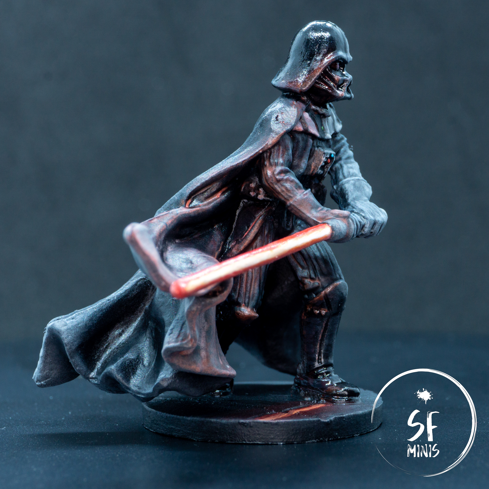

There's nothing better to find my lost motivation to paint, than to do it on my favorite character of one of my favorite sagas. I was really looking forward to this project, and I am quite happy with the overall result. On the table, Darth Vader will look as terrifying as he is supposed to be, and his saber will strike fear even in the bravest heroes!

This paint job was simple enough to just require 3/4 hours of my day, so that I could complete it in a single sitting and mark it done. I followed [this fantastic guide from Sorastro](https://www.youtube.com/watch?v=Je0zpTdwyjQ&ab_channel=Sorastro%27sPainting), which I strongly recommend. Honestly, 80% of the job is carried out by the primer, and the rest depends on how far you want to go with things like contrast or Object Source Lighting.

---

After priming the miniature black, the next step was to paint the leathery parts. I mixed various ratios of black and light blue/grey to create some volume on the arms, gloves, torso and legs, going brighter with every coat. Bearing in mind that the next step would be a wash, I went really bright with the latest layers, thinking that they would be dulled down later (which they did, to a degree). After applying a couple of dark washes, I returned to the most exposed areas and brightened them a little, especially on the hands and the most prominent folds in the leather.

Right after that, I moved on to the cape and the armor parts (helmet and boots). Since I was already starting from black, it was impossible to shade it darker, so I just went up with light using a similar mix of black and light grey as for the leather, just in a darker shade. I kept the back darker than the front, since the latter would be "lighted up" by the OSL from the saber. I also applied smaller and smaller volumetric highlights on the armor using similar mixes of color to save time.

I actually found these to be too stark after they finished drying, so I dulled them down with a couple of glazes of very watered-down black, to blend the layers better and reduce the glare. After that, I also painted the eyes a slight brownish color, to simulate the red lenses that Vader shows in the movies. After this, I added the minor details such as the led lights on the chest piece and belt, and the metallic bits of the saber.

---

Then came the most fun part. I first painted the saber with increasingly brighter layers of red, orange and white. This was a good challenge because it required to settle on a viewing angle, not dissimilar to how non-metallic metal works. If watched from the wrong angle, the saber looks just wrong, but it's really impossible to simulate the effect of the glowing blade in a different way. At least, if it is, I haven't found how to!

Once the blade was completed, I started glazing most of the right-hand side of the miniature with dark red, reducing the area of the glaze and adding yellow to the mix at every layer. I stopped after 5 layers as I didn't want to completely overwhelm the miniature in red, but I decided to edge-highlight the folds in the cape closest to the light source, as well as the edges in the armor and hands. The effect turned out better than I'd hoped, especially considering that my previous forays into OSL were not very successful and I always had to touch them up to fix mistakes and overexposure.

---

The last step was the base. I tried to create a sci-fi feel on the existing base by digging two perpendicular lines, to simulate some kind of tiles. I painted the whole thing with a very dark metallic silver, then tried a couple of approaches to reflect the light from the saber. The best one was to make the surface really reflective, drawing the shape of the blade right underneath the light source as if on a mirror, and dispersing some light from it with progressively darker shades of red and brown. I also dulled the metallic effect right underneath the miniature to create a shadow.

Then it was time to seal the work with some matte varnish. Unfortunately, having completed this during the night, I failed to see that the weather was misty, and the miniature gained a bit of "frosty" effect from capturing the humidity in the air while priming. I should have known better, but the hands and cape turned out much lighter than I was expecting them; however, the effect wasn't bad enough to make me want to go back to the table and correct it. So after that, I just slapped some gloss varnish on the helmet and boots, and called the mini done.

---

I'm actually looking forward to the next few projects in the Imperial Assault line. I have a bazillion stormtroopers to paint and I want to try a couple of ways (and Sorastro is still my friend here.) I've gone on a shopping spree and ordered most of the catalog of the expansions that I was missing, so hopefully this newfound passion for the game won't leave me soon and I will keep churning out miniature after miniature and trying new techniques.
