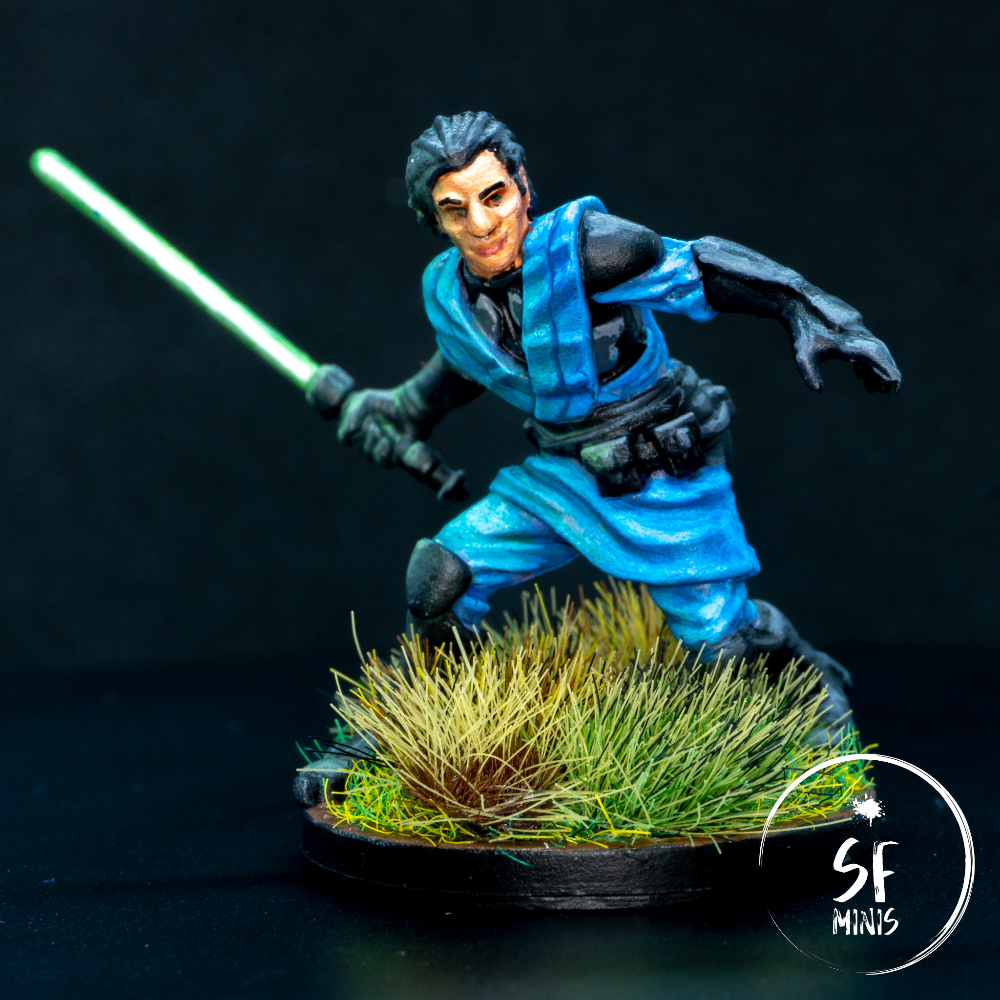
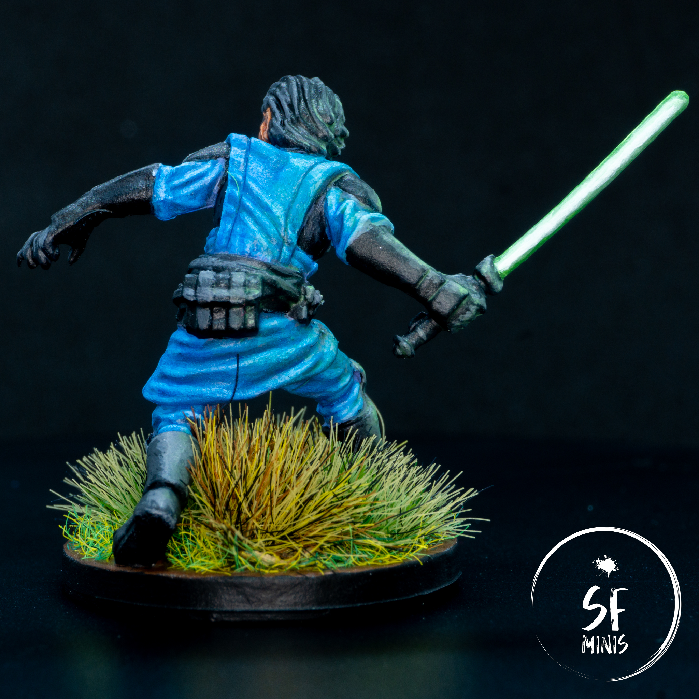
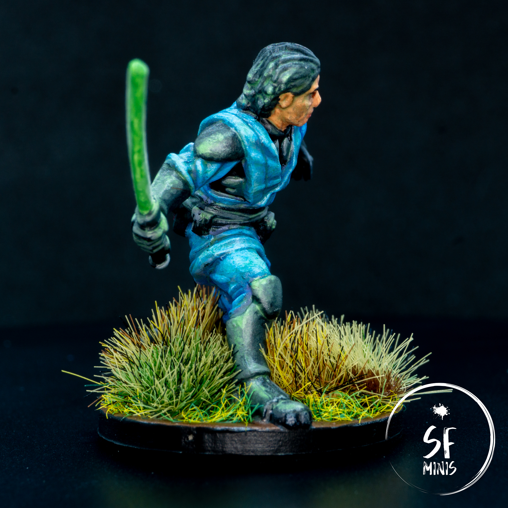

Second out of our next four characters, Davith Elso AKA Hawkbat was a pretty simple and straightforward miniature to paint. The sculpt is among the most accurately detailed ones I've done to date, which made it quite easy to bring to life. Except maybe for the face, which tends to look on the chubby side compared to the original art unless you pay close attention to properly shading the sides of the chin and nose.

Overall, I focused on four main areas:

- The face and hair
- The black/grey armor
- The blue cloth
- The lightsaber and Object-Source-Lighting effects

Let's go through each one, step-by-step.

---

The first thing I painted was the face. My approach is usually to start from the most recessed areas, as they are usually harder to reach, which makes me more prone to error of overflowing on the neighboring areas. If I paint these first, then I can just correct the mistakes by painting over them when I move on to the next part, provided that then I'm as careful as possible to not overflow on the one I've just finished working on.

In Davith Elso's case, the face is not its best feature. The original art has a very slender and sleek face, but the sculpt shows a fat nose and chin. To correct these, I used a lighter tone on the front of the nose as well as the cheeckbones, forehead and chin, whereas I shaded it aggressively on the cheeks and (to a lesser degree) sides of the nose.

I also decided to follow the art and paint his eyes with a simple black dot, to make them look thin. I don't think painting the white of the eye would have worked in this case (thanks to the research I did on Google before painting for tipping it off.) As for the general process, this was a normal course of basecoat, wash, layer, highlight and super-highlight; however, I found that the result was again too pale for my liking (as I mentioned in the previous post, I'm still learning how to paint skin tones) and I decided to glaze over a very thinned-down layer of tanned flesh color, which dulled down the contrast a bit but made the face a bit more lifelike. After that, I painted the eybrows and lips, and moved on to the hair.

I did not spend too much time on the hair. Black coat, grey highlights on the sides with a more aggressive highlight on his right side to facilitate the OSL (to which I'm getting later.) They are not the main focus of the miniature and I did not spend extra time on them to make them stand particularly.

---

The next step was to paint the black/grey armor and blue cloth. I started from the black bits on the chest and sides, highlighting the armor plates with a couple of shades of grey, and then proceeded to paint the cloth.

I decided I would paint the base coat in a darker purple and progressively highlight it with a mix of purple and blue, and then blue and white. The miniature is quite well detailed, with very defined ridges which made for a good area to build contrast on. However, once I applied the last highlight, I was not satisfied of the result as I had built too much contrast and made it seem like light was being passed through a blinder - it simply was not working. So, to fix it, I decided to dull down the dark areas by glazing over them a couple of times with a slightly lighter shade of blue that more closely matched the highlighted areas. To bring all of them together, I then applied a final glaze to all of the cloth. The result was far better than I'd have hoped! It looked quite natural yet still retained some of the contrast that I wanted to apply originally.

Later, I would also find that some of the darker areas had been misplaced. I am now very used to highlighting from a zenithal angle, but I didn't take into consideration that there was another source of light in the scene, and a pretty strong one too - the lightsaber in his right hand! I would have to correct the errors with some more glazing, as we'll see in a bit.

After I was satisfied with the cloth, I then painted the remaining armor bits (shoulders, gloves/hilt, boots and belt) highlighting them with progressive lighter grey. I tried to keep in mind the origin of the strongest source of light on every piece of the armor and I think it turned out quite well - but in technical terms, this was nothing out of the ordinary.

---

Last, was my second attempt at OSL from a lightsaber, after the work I had done with [Darth Vader](/darth-vader/). I followed a similar process for the saber and the light effects, which proved to be quite good. I first coated the blade in pure white, and then proceeded to lay a couple of layers of darker green. While I was waiting for them to dry, I prepared a very thinned glaze of the same green and started to apply them to all the major areas on the right side of the miniature, making sure that I would drag the brush in the direction I wanted more color to be applied to. This is important as the color deposits more heavily on the last part that's touched by the brush, so that needs to be the one that's closer to the light source.

I then applied progressively lighter mixes of green and white to the core of the blade, reducing the width with every layer. At the same time, I kept applying glazes in smaller and smaller areas, sticking ever closer to the lightsaber. This took about 4 layers before I was happy with the result.

However, I could still improve the OSL by highlighting the areas that were more exposed to the light further. I simply mixed a lighter green into the glaze medium, and proceeded to lay a couple of extra layers on the edges and raised parts that I wanted to make brighter. An example of this is the face and hair, which were still too dark, and the knee pad. With this touch-up, they looked exactly like I wanted them.

---

To complete the miniature, I decided to base it in "tall" grass. Since his main strength is the ability to hide easily after striking, I thought it would be more thematically accurate.

There are still a bunch of other lightsaber characters to paint, such as Jedi Master Luke or Diala Passil; hopefully, the lessons I'm learning from these early models will make them look even better on the table.
