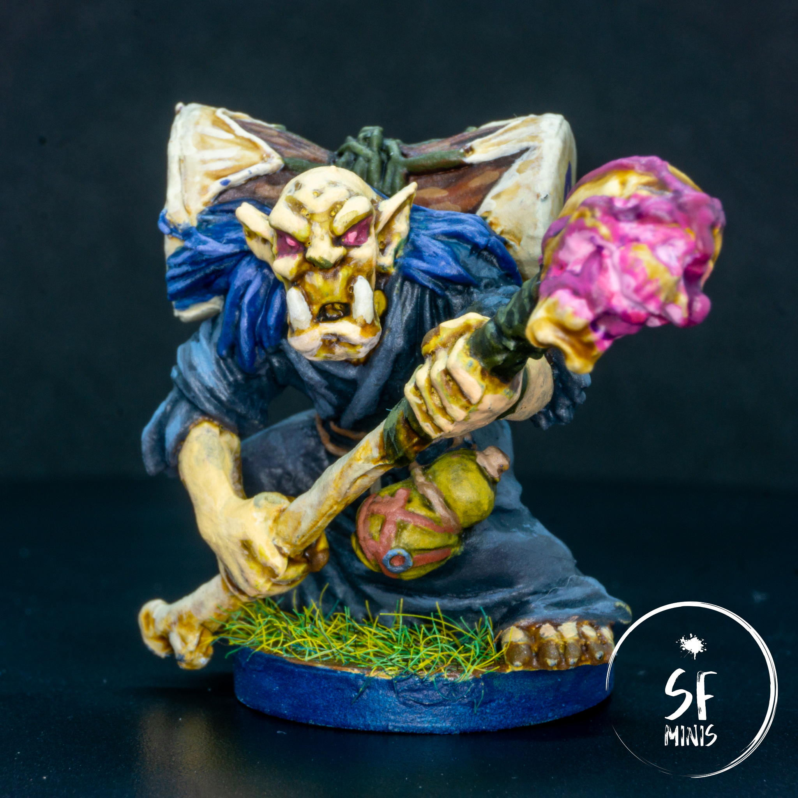

Elder Mok was a different project on a variety of levels. First, the miniature is quite small, at 2/3rds of height of a "human sized" mini. This means there's obviously little space for error and mistakes. In addition to that, the colors in the reference art are all very cold and, frankly, unimpressing, except maybe for the purple glow on the wraps and skull. And last, there's a component of freehand drawing which I am not very fond of, as we'll see in the final part of the post!

The skin was something I toyed with and made different than my previous projects. I wanted him to have a greenish glow, to highlight not just his race (I think he's an orc?) but his old age as well. I mixed in some light green in between very light skin tones, gave it a military shade wash, and highlighted progressively, and I think the result was decent. I purposefully left some darker areas even on top of the skull to show some skin aberrations, and overall upped the contrast as much as possible to enhance the wrinkles from old age.

---

I had some fun with the drum as well. I painted the wood first, with some progressively lighter browns and making sure that they would not blend but remain quite starkly contrasted. With the drum skin, I used a mid-light beige as my base tone, washed the recesses with a warmer brown and then highlighted all the edges with lighter beige. I concentrated especially on the outer side of the drum edge, to give the idea of the skin being really stretched thin, and I think the effect was successful.

Then it came time for the freehand drawing, which as I said I am not good at, and it shows: the drawing on the right is completely off-center, too small and not detailed. The one on the left is just a fancy "S" because I'm a narcissist (my name starts with an S.) They don't ruin the model, but I can **definitely** see areas for improvement.

---

Moving on to the tunic, I also experimented a bit here. The original color scheme in the reference image was a very bland, dark grey that was not really exciting at all, especially for something that takes up so much space on the miniature. I decided to give it a blue hue instead to contrast the very light, green-ish color of the skin. The gist is the same as always: dark grey basecoat, dark blue glazes on the recesses, and light blue-grey progressive highlights. I really like how it contrasts and the subtle blue effect. I think one of the reasons I chose this color was to avoid just adding white to the mix, as suggested by Trovarion in one of his videos (I think [this](https://www.youtube.com/watch?v=vmY6eLWxydo&ab_channel=TrovarionMiniatures) is the one I'm talking about, but I'm not sure and don't really want to go back and watch it again now!) I highly recommend watching his videos, they are helping me so much!

The only downside of painting the tunic blue was that the hair would not stick out as much as in the reference image. I tried to mix in a bit of purple but unfortunately I don't think they differ enough and I didn't want to make any further drastic changes.

---

Lastly, it was time to paint the bone, crystal and wraps. While I now have a fairly proven process with bone (light beige, contrast paint, progressive highlights), the skull was a challenge of its own because I wanted to give it a similar effect as my [Sorcerers](/sorcerers/), as if smoke was pouring out of it. However, there were some significant differences between the sculpts:

- The sorcerers had a rounded metal halo around the skull, which could be used handily to amplify and reflect the effect of light and smoke. Mok doesn't, and I wasn't really able to make up for the lack of it.
- Mok's skull has a huge crystal in its mouth, which makes it even harder because I had to take into account the OSL and reflections from the sphere on the rest of the mouth. These kind of canceled out with the effect I wanted to give.
- The whole skull is covered in wraps which, unfortunately, have a very similar purple hue as the glow. This was the most difficult thing to get right, and probably the one I struggled with the most, because it was hard to show where the glow effect finished and the wraps began on the model.

I actually painted it once, varnished it, and then disliked it so much that I painted over it again and made it more subtle. It surely doesn't have the same eerie effect of the sorcerers, but at least it is still relatively convincing and not too much in the viewer's face.

---

With this miniature, I am now done with the new party we created for this next campaign. We decided to try our luck with a new Road to Legend campaign in Hard Mode, and so far they have been kicking our asses even though we chose some of the most powerful classes and characters in the game! We'll see how it goes when we keep growing and getting exp, I guess.
