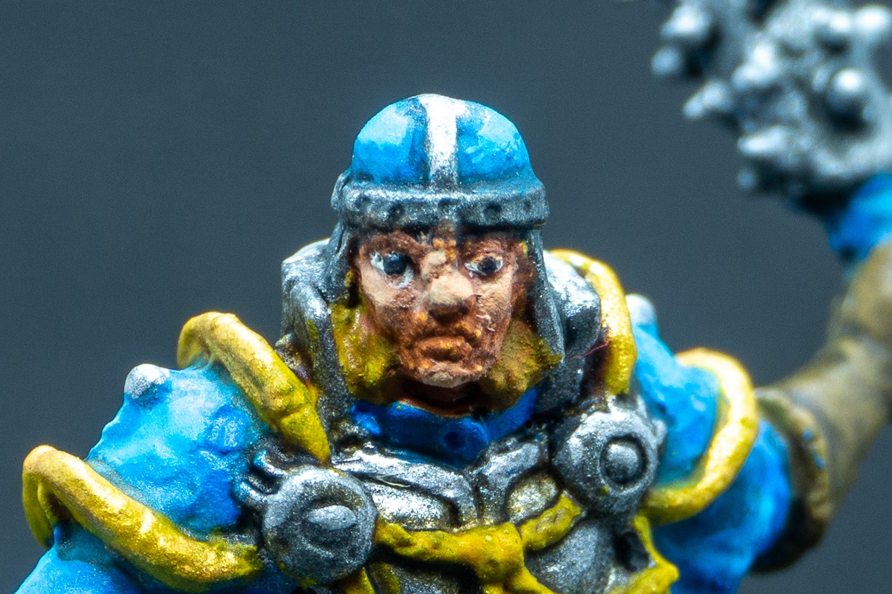

Hello, dear reader! Thank you for landing on my humble blog.

My name is Simone, and I love boardgames, especially those with many, _MANY_ detailed miniatures.

For those who also share this passion, my favourite is called "Descent: Journeys in the Dark - Second Edition". It is a brilliant dungeon crawler with tons of minis, loads of expansions and a list of contents that is currently filling up half of my closet space. It is **GLORIOUS**!

Other titles that you will probably see in my posts include "The Edge: Dawnfall", "Horizon Zero Dawn - The Board Game", "Lords of Hellas", and potentially new titles such as "Descent: Legends of the Dark" and "ISS Vanguard" (just to name those which I am pretty sure I am going to buy - pending approval from the missus of course!)

If it weren't for budgetary (as well as space) limitations, I would probably add some skirmish and wargames to the list, but I don't think you will see many of these on this blog, unfortunately.

> My collection has more than doubled since the time I took these pictures

---

Given all of these miniatures, it was just a matter of time before I picked up painting again.

I used to own armies of Uruk Hai back as a teenager, when I could count on my parents' money and lovely home. I had amassed a pretty impressive army at the time, and I mostly entertained the hobby for the painting side of it, to bask in the glory of a well-painted sculpt, than to play with it.

Unfortunately, like many hobbies as a teenager, I eventually thought I had "grown" out of it and picked up something else (namely, MMORPGS - which in hindsight took a lot more of my time than wargames.)

But last year, looking at the sheer mass of unpainted plastic that I filled my house with, I grew nostalgic of that feeling of creativity, and decided to purchase some Army Painter colours and brushes, and give it another try.

Fast forward to today, and I am now in full swing - not only did I end up purchasing the entire line of colours, but I am trying to keep up painting as frequently as possible. I aim to 1 miniature/group of minis a week, although work and other commitments often slow me down significantly.

---

As you will see from most of my next posts, I still have a long way to go to learn painting properly. Some of my "earlier" works are honestly sloppy (you will see how **NOT** to paint a face on my post of Avric Albright of Descent - 2nd Edition) but I still intend to publish them on this blog to discuss what went wrong, and what I have learned from and since them.

.

> Poor guy, he was hit in the face by a dragon. Repeatedly. With another, smaller dragon.

My path is clear: I just need to put my brush on more plastic and continue improving, getting out of my comfort zone and trying out new techniques until I have mastered them. I hope you will decide to be part of this journey as well and it will be at least a bit helpful to you as it has been for me!

---

And lastly, in an effort to share these creations, I decided to create this blog.

As a web developer, it was a good opportunity for me to flex my "muscles" and have an excuse to do what I love to promote something else I love. I will probably continue to add small "features" to the blog, such as links to specific posts on my social accounts, or a way to contact me if you are curious about a specific paint job or miniature.

I am also venturing into photography (talk about love for learning!) as you can see from the main photo of this post. I expect to see myself improve drastically on this front as well, so forgive me if the initial results are still a bit "scrappy" - I promise I will do my best to continue adding better and better content and show my progression on multiple levels.

---

Once again, thank you for making it so far, and see you in my next post!
