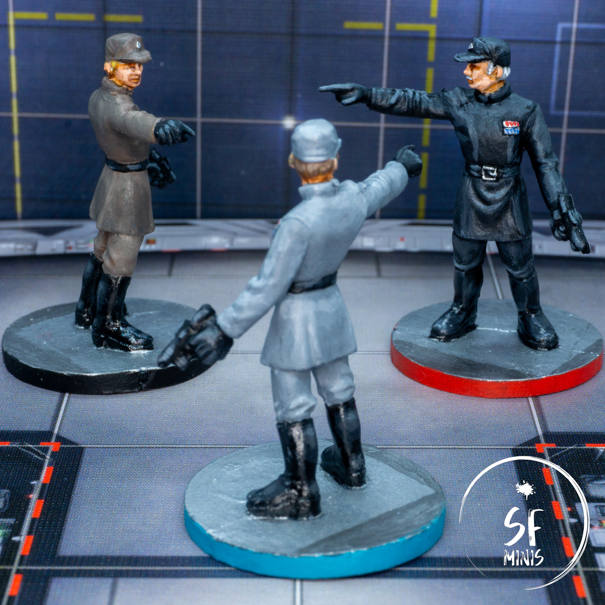
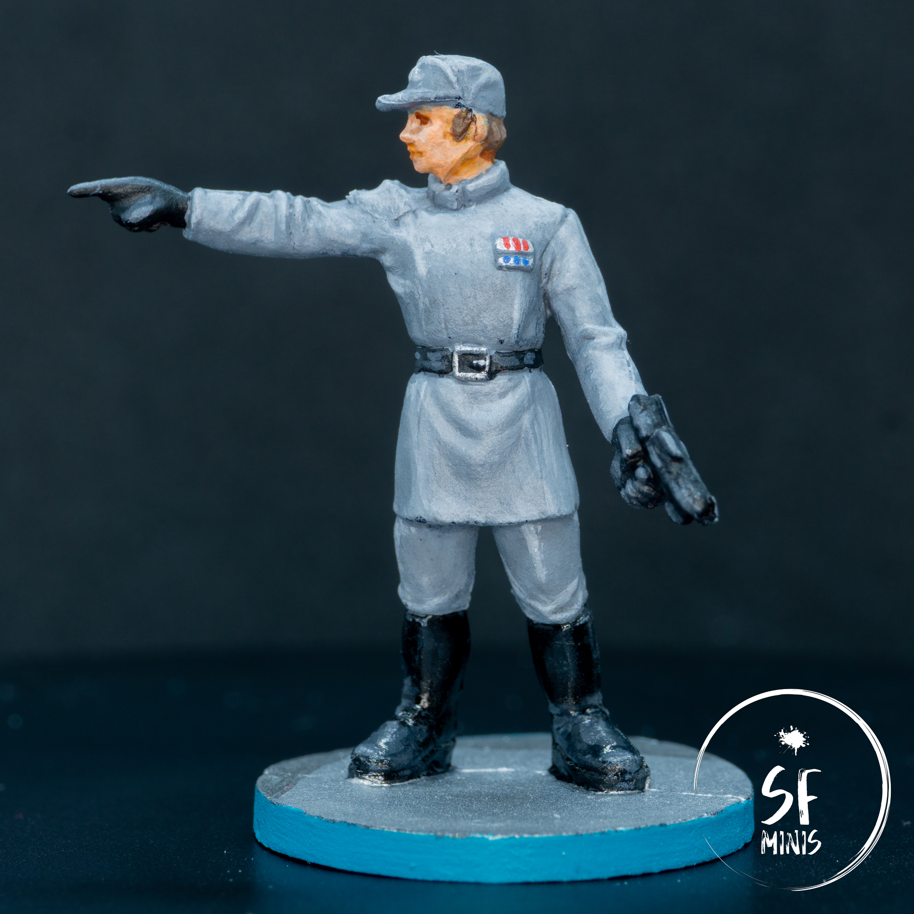
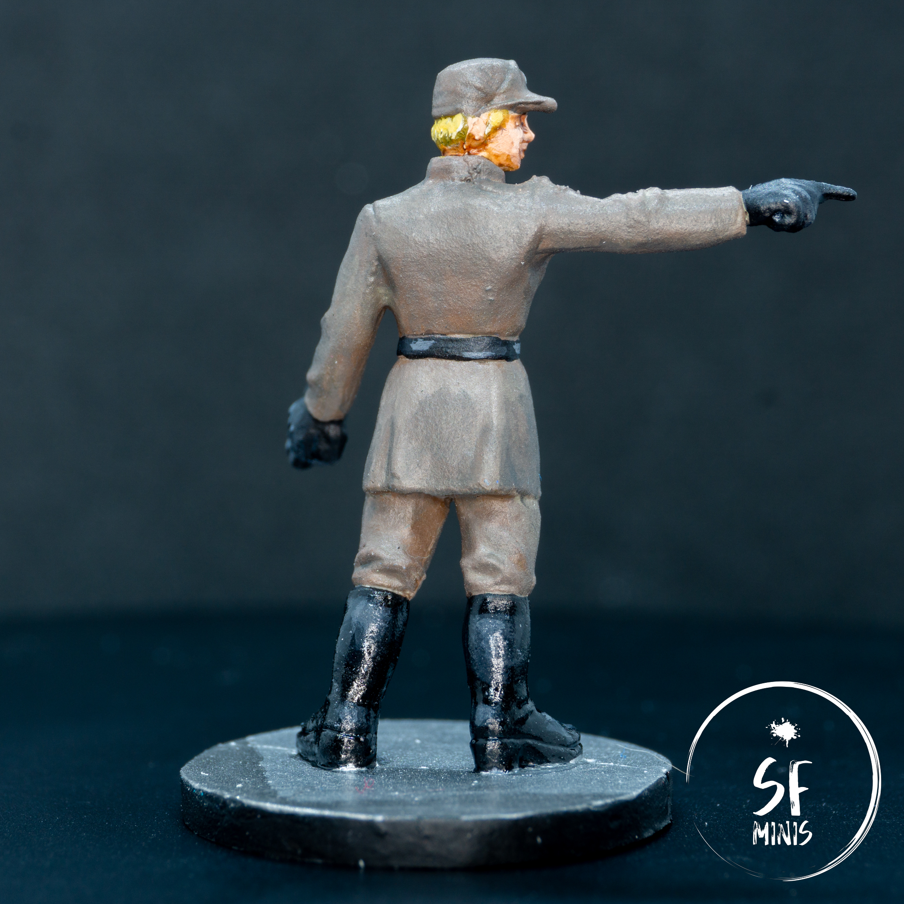
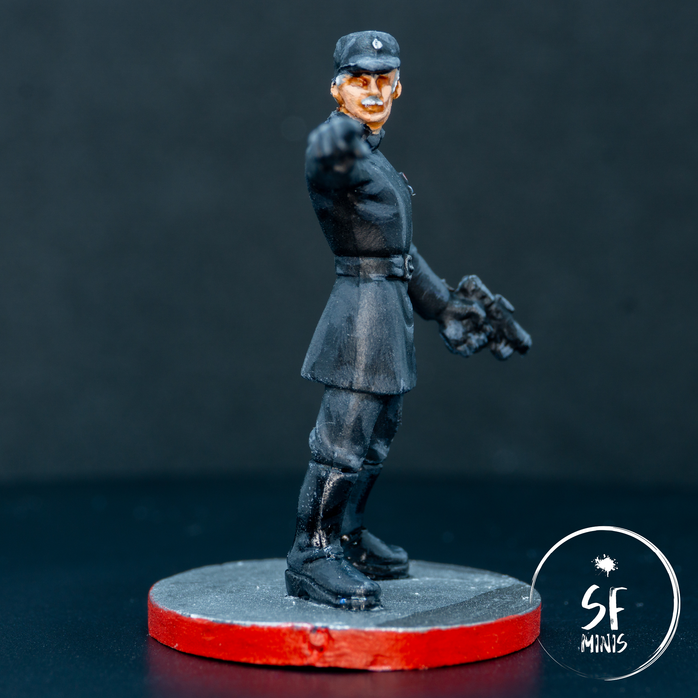
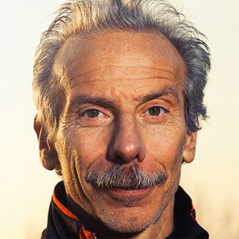

After I was done with my previous paint job on [Shyla Varad](/shyla-varad/), I wanted something quick and easy, that I wouldn't care too deeply about. The Imperial Officers looked to fit the bill perfectly as they were relatively straightforward and I wasn't invested in spending hours making them perfect, I just wanted _something_ done in between heroes.

They took relatively little time at just over 5 hours, most of which I spent getting the khaki color scheme fixed. But I'm getting ahead of myself.

I decided to approach them in bulk. I wasn't sure how to differentiate the different deployment groups, so I took to the internet and found that there are multiple versions of imperial uniforms in Star Wars lore. I watched [Sorastro's take](https://www.youtube.com/watch?v=twWddr1YTsA) but while they looked good, they didn't comply with anything canon that I could see. So, eventually, I settled on three color schemes:

- Khaki, with blond hair, for the junior officer
- Grey, with brown hair, for the intermediate one
- Black, with grey hair and mustache, for the senior officer

And with that, I set off to paint.

> At the Academy, this is known in the inner circles as an "imperial standoff"

---

The first thing I did was to paint the uniforms. I did all three miniatures together, step by step. After I primed all of them black with a zenithal grey highlight, I gave each a couple of thin coats of base layer. The black and grey were straightforward, but the khaki gave me some problems.

I took a similar approach as outlined in my previous post, picking the colors from the browser, but no Army Painter native color would really reflect the one I had picked for this junior officer. So I started mixing and the first coat came out too green and much darker than I wanted it. However, I left it for later to fix, and I then proceeded to highlight the raised ridges and upper body in the respective light tones. After a couple of coats, I was moderately satisfied with the contrast, although the only one that I was really happy about was the black officer. The grey had turned out too bright, and the khaki was still off hue.

---

So I set off to fix the grey one first. I simply glazed over the miniature with the base grey tone to dull it down, and after a couple of coats it was definitely more believable.

As for the junior one, I enlisted the help of my girlfriend, who can actually distinguish colors, who picked the perfect bottle from my shelf of Army Painter colors. Turns out the mix was missing a bit of very light green-beige, that I added to the brown and, again, glazed over the miniature. This was much better, but the highlights were still a bit too bright and looked "dusty", so I repeated the process by adding a bit of black to the mix and repeating it once more in the areas not directly hit by the sun. I would probably have had a better result by re-applying the base coat and highlighting up again, but as I said earlier, I wasn't as invested in these to warrant the additional effort. This was good enough.

---

Next, I painted all the black parts (gloves, gun, belt and boots,) and, again, highlighted them slightly with a grey. After that, I set off to paint the skin, which I wanted pale-ish (especially for the senior officer.) The process was quite simple, with a pink base coat, a very light wash, another darker one on the eye sockets and lips, and finally a couple of highlights on the nose, chin, cheekbones and ears.

I decided against painting the eyes for two reasons:

1. The eye sockets were pretty deep and the eyes would have needed to be really small, otherwise they would have looked either very surprised or completely mad
2. It's already difficult to get 2 eyes right, 6 is downright miraculous

So I just left them shaded, and although in the pictures they look like zombies, on the table they are absolutely fine (the hats cover them anyways.)

Coming up, was hair. Nothing really fancy, same process as everything else (base, highlight, highlight narrower,) with the small exception of the glorious mustache on the elder officer, which turned out pretty sweet. Also, it makes it look **EXACTLY** like a very famous Italian comedian, Giovanni Storti, as the pictures below will attest:

> Ask any italian about [Busto Garolfo cops](https://www.youtube.com/watch?v=tb_2TJjsq4g) and they will see the resemblance in an instant

---

As for the last steps, I painted the small metallic bits, such as the badge holder, belt buckle and hat pin, added the ranks on the badge, based, varnished and coated the boots with a glossy varnish.

I think, for the effort they took, they turned out pretty well.

Next up, our next campaign second hero: Davith Elso, AKA my second take at a lightsaber. See you then!
