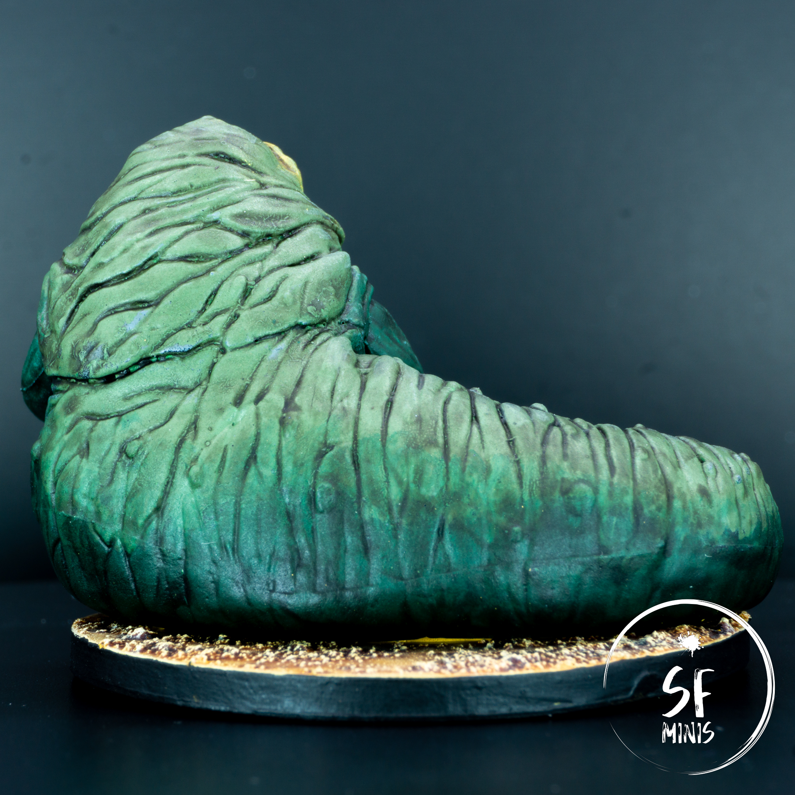
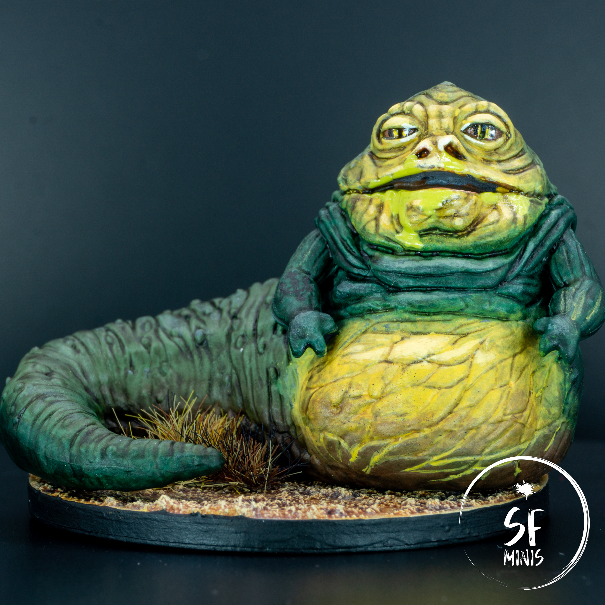

After painting the Stormtroopers, I chose Jabba to scratch a specific itch: I just wanted to slap some color on the miniature, blend it, and not have to care too much about lines or precise details. Considering that the whole thing about him is that he's a slimy, dirty slug, I could get exactly what I wanted. Also, there's an excellent [tutorial from Sorastro](https://www.youtube.com/watch?v=imFCPPLFwp4) which I followed quite to the letter and produced a really good finish.

This provided me with an opportunity too: I recently read about adding retarding medium to help with wet-blending, and I was curious to try it since one of the issues I've always faced with the technique (and painting in general) is that paint dries so quickly I can't really blend it well without producing "coffee stains" or paint streaks. Where I live, we heat our place with underfloor heating, which dries the humidity significantly (at times, below 30%,) and means that even my wet palette gets dry in a manner of one or two hours.

---

I won't get too much into detail on each step I took, as they are fairly well detailed and explained in Sorastro's video. However, as this was a learning opportunity, I will focus on describing what I did wrong and how I fixed it later.

1. Adding medium before laying down the base colors.

   The first mistake I made was to add retarder medium to the colors right at the start. I basically picked all of the colors I wanted to use, put them on the palette, and added the medium in generous quantity. I soon discovered that the medium not only has a pretty thick viscosity, but it also significantly thins the paints, which made it hard to get an even base coverage as they had become **VERY** translucent. That required three, even four layers to get a decent opacity. Also, with the humidity problem I talked about earlier, a lot of my paint was starting to dry anyways before I even got to use it, so I had to keep rehydrating it and thinning it further.

   How to fix it: Paint the base layers first, before adding the medium. In the video, Sorastro does both at the same time, as he blends the colors in the same stage as when he puts down the base tones. I've found it's easier to just do one first, not worrying about transitions, and then wet blend the colors afterwards applying them only on the edges of the borders between the colors.

2. Adding too much retarder medium.

   This is a simple one: I used Vallejo Retarder Medium which is pretty dense and viscous. I was generous with the amount but that rendered the paints too thin.

   How to fix it: Just use less medium. Duh.

3. Watch out for the wash.

   I'm usually pretty conservative when it comes to applying washes, as I don't want them to be too thick and leave out stains or pool in recesses. In this case, I used it more freely because I wanted to achieve a "dirty" look, but in some areas it did not work out the way I intended and it just looked wrong. Also, I applied it quite carelessly on the face, where I should have paid more attention.

   How to fix it: Thinning the wash down further definitely helps. Nothing new here, just be more precise!

4. Don't be afraid to mix and match techniques.

   One of the principles of wet blending is that it will look better when it's dry. Which is true, but in a lot of cases it can be further smoothed out with additional steps, even though there's a primordial fear that touching it up will ruin the blend.

   How to fix it: As long as the color is dry, nothing prevents me from applying a glaze, or even layer up on top of the transitions. The benefit of the wet palette is that I can actually access the colors I've used before (provided they haven't dried up yet!) and mix them on the palette as I did on the miniature. That means that the hues should be very consistent and allow us to work and fix up without fear of screwing things up.

---

In general, painting him took me very little effort and time. Base colors, blending, touching up, washes, highlights, details, basing, varnish and last effects. Pretty much business as usual, but with the miniature being fairly big, with very few hard to reach areas, and no hard limits and zones, this was a very good cure for the frustration of the previous paint job. I could be messy; I was, and it was good!
