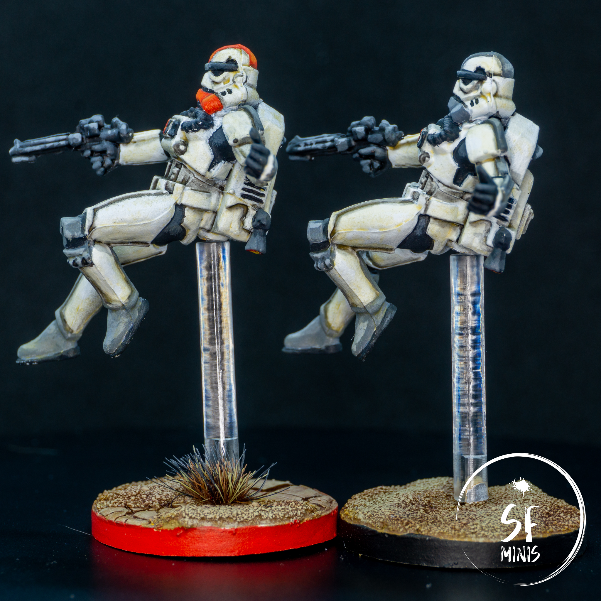
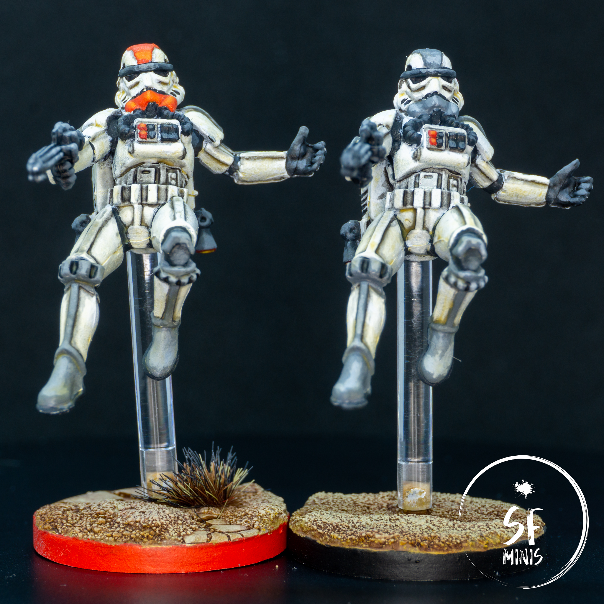
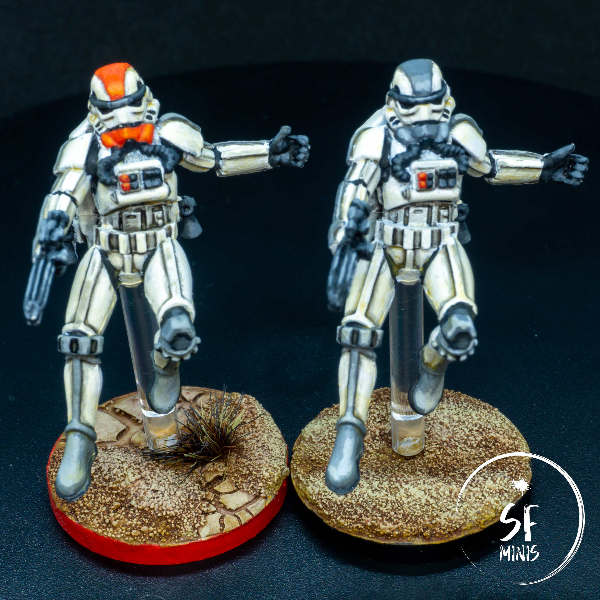

These little fellas were some of the most difficult miniatures I painted to date. This confirms that white armor is my, well, white whale, although differently from the striders and watchers I painted a few months ago, I am actually satisfied with the result this time. Even though it took me almost twice as much as any other project to date.

One thing I really struggled with is how to build volume on white armor. I know I'm supposed to start from a greyish off-white color and then build up the lightest areas in white, but I couldn't see that working in this case where the stormtroopers armor is just white! Initially, I wanted them to look like they just landed on Tatooine, pristine and clean (more on why I changed my mind about this later,) so I couldn't see myself starting from a darker tone.

---

I began by priming the miniatures white. Duh. These were a little bit of a challenge as I had to remove them from their transparent supports (which I wanted to keep unpainted) and put them on temporary ones made of sticks and putty. I was actually scared that I would blow them away with the primer (and off my balcony,) since the supports were a bit flimsy, but they stood.

Then I started to paint the black and dark areas of the armor. Some of them were not very easy to reach, so I took a cautious approach with multiple, thinner layers that could be fixed easily. The difficult bit with that is that white is tricky to get right: thin it too much, and it won't cover the color underneath even after a million layers; lay it on too thick, and it will show a grainy, chalky texture that doesn't apply at all to the shiny look of the troopers' armor.

---

Once I was happy with that, I touched up major mistakes and began the lengthy process of shading. Again, white (and generally very bright colors) are somehow challenging because any excess shading compromises the underlying color very easily. The best approach I've found to give these raised areas volume was to very carefully shade the recesses with thin lines of dark wash. This process takes time and care, specially fixing up any major blunders afterwards. As with the previous step, it's better to go easy on the layers and repeat them a couple of times, even if it requires patience.

Next, I painted the colored parts on the armor. The reference image shows two troopers with grey markings on their helmet, arms and legs, so I took inspiration from that and painted two of the miniatures like that. These were the regular units.

As for the elite units, I wanted to give them a red accent, but I didn't want to saturate them too much. I chose a dark orange as the base color for the helmet parts, and I left all the other grey markings the same so that they would still look similar to the other group.

In both cases, the process was straightforward: after applying the base layer, I added some light color to the mix (yellow for the red areas, white for the grey) and progressively highlighted smaller and smaller bits to simulate the reflection of the light. Interestingly enough, I recently watched a tutorial about painting hair, in which the highlights were placed on the front rather than on the top, and I could see how they looked more natural while looking at them from in front of the mini. It wouldn't work as well from the top, but I thought it was a good compromise between seeing them at an angle on the table and looking at them on a shelf.

In hindsight, I probably should have completed this step before the shading, as it would have saved me some time fixing mistakes and re-shading some areas that I covered with the new color.

---

Before jumping on the bases, I decided to spend some extra effort on the troopers' armor and glazed it in a yellow-orange tint to simulate the wear from the desert. I was actually quite afraid to mess it up, but I think the result turned out fine and it didn't ruin the original work. The reason for this was because I wanted to base these units in a desert town such as Mos Eisley, and they would have looked out of place had they been all white and shiny.

To get the bases right, I started by building volume. I used Citadel Technical paints to create small sand ridges and cracked ground. Once they were dry, I sprinkled fine sand on top of the raised areas and the edges of the cracked parts, to create a transition between sand and ground. I then primed them brown and progressively built light on top of the dunes. Finally, I highlighted the parts in the sun with an ivory color, washed the ones in the shadow with a mild wash, and re-assembled the units. Painted the rims, varnish, and they were finally done!

---

I learned a handful of new things with these miniatures, and although I'm happy with the result and how it will look on the table, there are some things that I would have done differently to speed up the process and help me not get mad.

Luckily (or not,) I have other 15 or so Stormtroopers to paint, all from different expansions, so the practice will definitely help and they will eventually look better and better!
