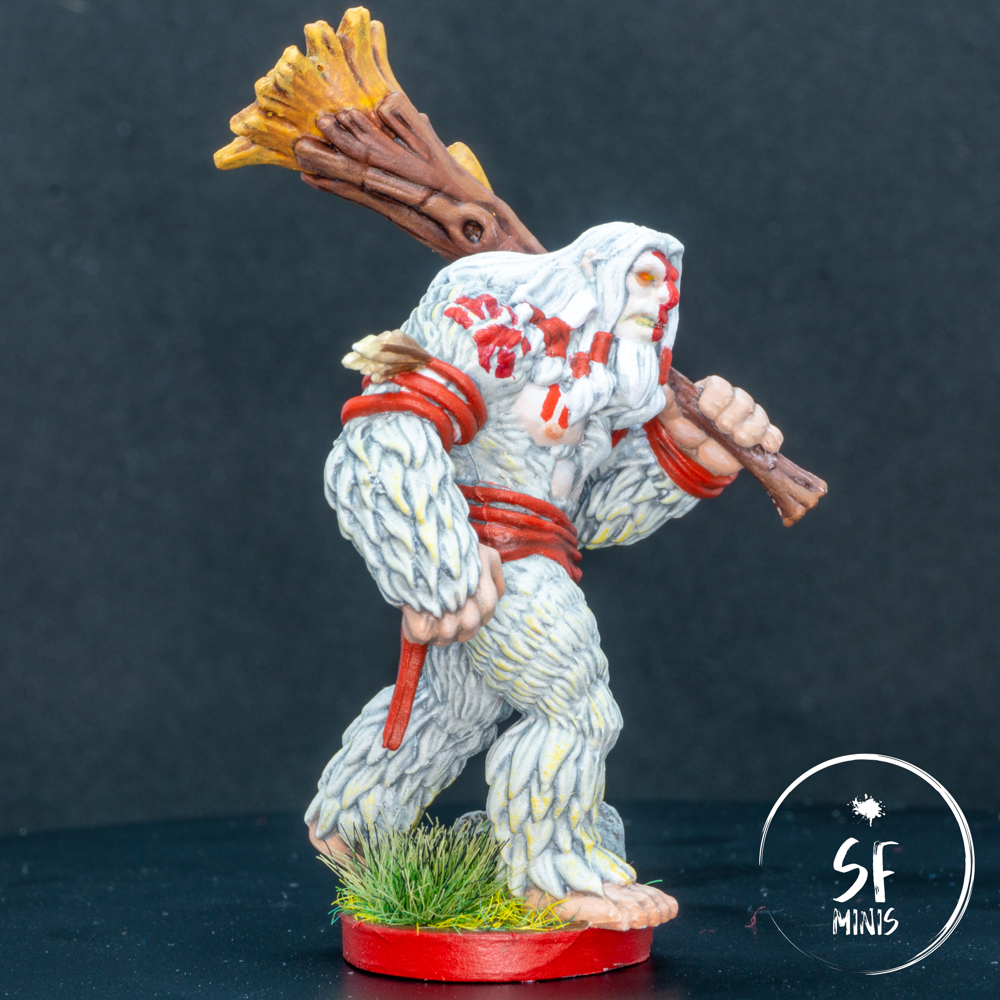

To date, Karnon is one of the paint jobs I am most fond of. Not because of its complexity (it's actually fairly simple,) its colours, or any particular technique I used to paint, but mainly because it turned out _exactly_ the way I wanted it. There is very little I would change, which is extremely rare and something I need to enjoy while it lasts.

The backstory of this character is that it's a half giant, part of a race of warriors that are usually not welcome in the civilised world, and seen as harbingers of destruction. However, he is dedicated to good and using his talents to save the world from darkness. The miniature itself is much bigger than a normal, "human" sized Descent hero miniature: next to some smaller heroes such as [Elder Mok](/elder-mok/), it is almost twice as big! This makes it a lot simpler to paint, with very few hard-to-reach places and less space for sloppiness and error.

Also, this is only the second miniature on which I've used my shiny new set of brushes from Squidmar's Kickstarter, the "MK I". No way around it, compared to my previous Army Painter brushes, they are just a whole different category. They make precise jobs seem almost trivial by comparison, and it shows from the red cloth and bands on this sculpt, as well as the body paints. If I had used brushes of lesser quality, I would probably have had to retouch and fix quite a few mistakes (that is, based on my experience with previous models,) however this was not the case. They can keep a sharp tip when paint is loaded, which seems like brush 101 but is not at all guaranteed with cheaper brushes. The only thing that I still have to figure out is how to load more paint without the risk to get it too close to the ferrule that it may ruin the shape.

The first thing I actually painted was the log. I experimented a bit with colors, mixing some reds and browns to achieve the hue I was looking for, and I got close. This was a fairly standard painting process, with base coat, wash and brushed highlights of lighter colors. I could probably have added more contrast to the lighter tones, but I think it came out all right and it looks relatively realistic. Multiple thin washes made the job on the "yellow" part to enhance the contrast of the recessed areas without looking like they had been dipped in color.

---

Next thing, I painted the fur with a basecoat of light grey, a blue-grey wash and some progressively lighter drybrushed layers. Again, very standard work, but I took my time to make sure it would respect the zenithal illumination I wanted to give it. To add a bit of variety to the scheme, I added a brown-yellow layer which is stronger in the extemities, to add a bit of "dirt" to the fur and make it look more realistic for a huge, hairy warrior who (let's admit it) probaly won't spend his days in the shower!

I also made the hair on the head and beard whiter to separate it from the rest of the body, to give him a mature and experienced look.

Amongst all the hair, I also painted some bits of skin which I am really happy of. The face, chest and abs have an off-white gradient that almost seamlessly merges with the fur, as per the reference picture. It turned out exactly how I wanted it, with the nice addition of two tones on the nipples which enhance the effect of being lighted from above. Also, I painted the hands and feet a darker shade of pink and gave them a progressive zenithal highlight that is probably the best one on all the miniatures I've painted so far.

---

And last, I painted the red bits: the "freehand" drawings on the skin and fur, and the cloth and bands. On these, the usual process of basecoat/rough glazing/highlight created a subtle but noticeable gradient that, again, doesn't have the same contrast as some other pieces I've painted, but in my opinion looks more natural.

I probably should have cleaned up the log near the fur better, because in the shots it shows some white leftovers from the small mistakes I painted over; it's one of the problems with taking macro shots of your work, you can **really** see every minor brush stroke or imperfection from them, much better than when you are actually painting!

In summary, this was a relatively quick (6 hours maybe?) and "easy" job which I kept on my desk for a few days after I completed it to contemplate and look at. It's rare for me to enjoy the process so much, but when that happens it's really one of the greatest feelings of achievement!

P.S. Huge thanks to my lovely girlfriend who gifted me a rotating turntable to show every side of the miniatures! I will definitely add it to all my posts from now on, and I've already made videos for Belthir and Valyndra (incidentally, my two other favourite projects.)
