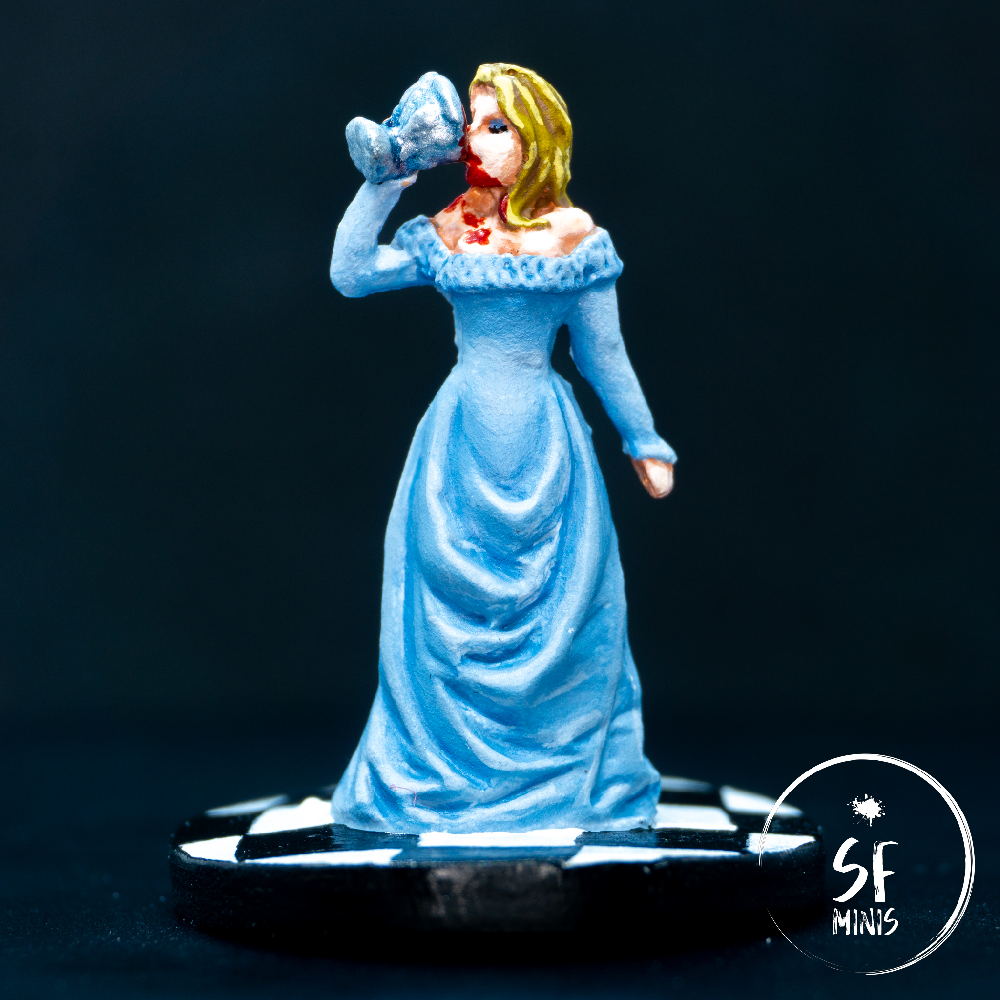
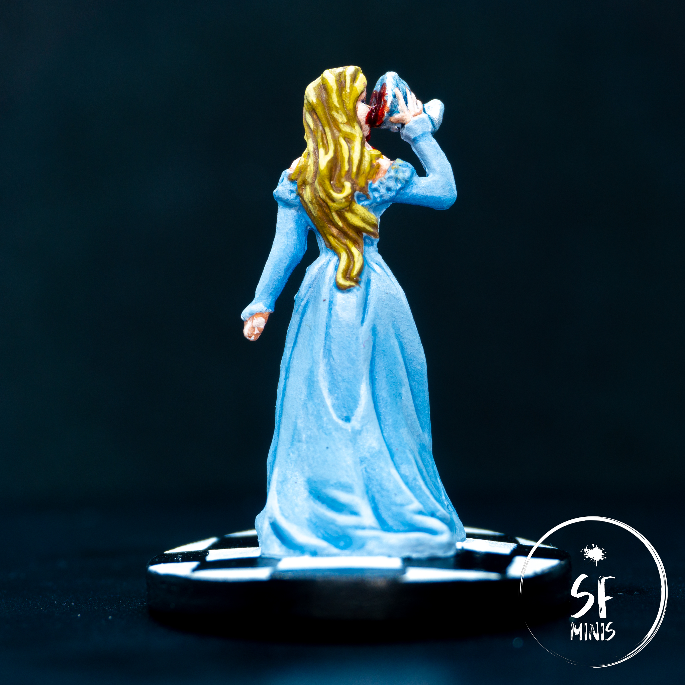

After a week's hiatus, I decided to get back into the groove by painting a lieutenant that I will probably not use but still find intriguing, even though the sculpt has extensive room for improvement. Lady Eliza Farrow has an interesting backstory as the wife of Lord Merick, and even if she seems more frail at first sight, her vampire powers make her a powerful foe to be careful of.
I took heavy inspiration from [Darth Tom's blog post](https://darthtomsgaming.wordpress.com/2020/03/05/lady-eliza-farrow-from-descent-2e/), and although I am happy with my result and believe that a few areas turned out even better than the original, I'm not 100% satisfied because I wasn't able to reproduce his results the way I wanted. I am very evidently way behind him in terms of brush control and color mixing, but I want to cut myself some slack here as both the quality and size of the mini are not the best in class.

---

Starting from the dress - I really liked his approach with huge contrast that made the miniature almost cartoonish (which is very much in line with his style), but after I tried to reproduce it my result turned out darker and with less contrast. I started from the mid tone as the base, then went down to the darker tones progressively (I tried to layer them instead of glazing, and I think the result was more controlled and better,) and later lighted it up in the areas most exposed to the light. This approach reminds me more of the reference image than Tom's, and I really like it, however it was a serendipitous result that I wanted to get different, which is kind of the theme of the whole miniature.

As for the goblet, I initially tried to approach it with a non-metallic-metal scheme, but it was not coming the way I wanted and I abandoned it in favour of a very simple metallic coat. Not the best, but it would do.

---

Moving on to the skin, I tried to amp up the contrast and am fairly happy with the result achieved simply by layering. I still need to find a better combination of colors, and looking at the reference from Tom's blog I can see he uses more browns than pinks for that kind of job. I will try to apply that in the next miniatures.

After the skin, the next step was the hair - I started from the darkest and progressively highlighted with lighter and more yellow colors, even though I may have jumped too much with the lightest coat. Here, the result was also very different from Tom's as he used warmer colours and spread the highlighted areas more wide - almost to achieve a "wash-like" effect for the brown and darker areas.

---

Finally, I added the detail of spilled blood, without exaggerating (there are some references of other paint jobs online that take it too far) and I painted the floor with a chequered pattern. Honestly, my freehand is just bad. I should have probaly removed the miniature from the base, used some masking tape to draw the squares, and then glued the miniature back on - too much effort honestly for its quality.

Overall, I like the pose, and I think the result is good enough to make a difference on the table (if we will ever get to use her,) but as always there is huge room for improvement. I have already primed Sir Alric Farrow and will probably paint him next with a very simple metallic approach, but after that I will probably change game and start cleaning up the miniature better from mold lines and imperfections.
