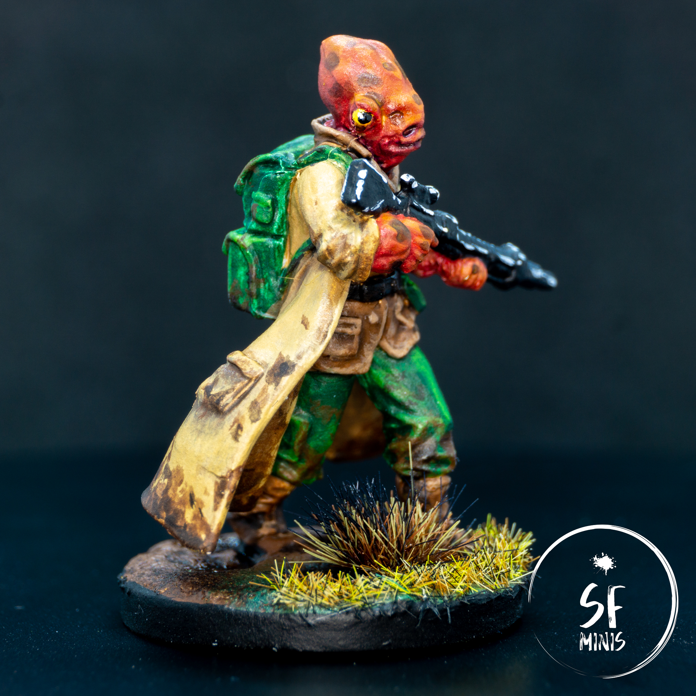
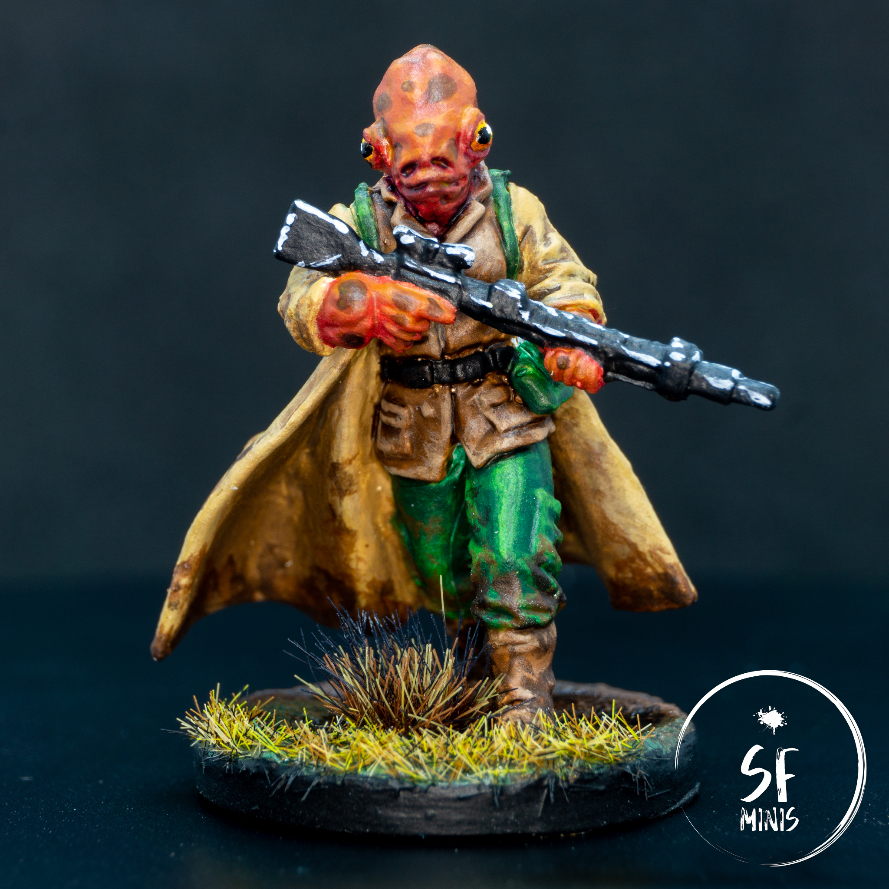
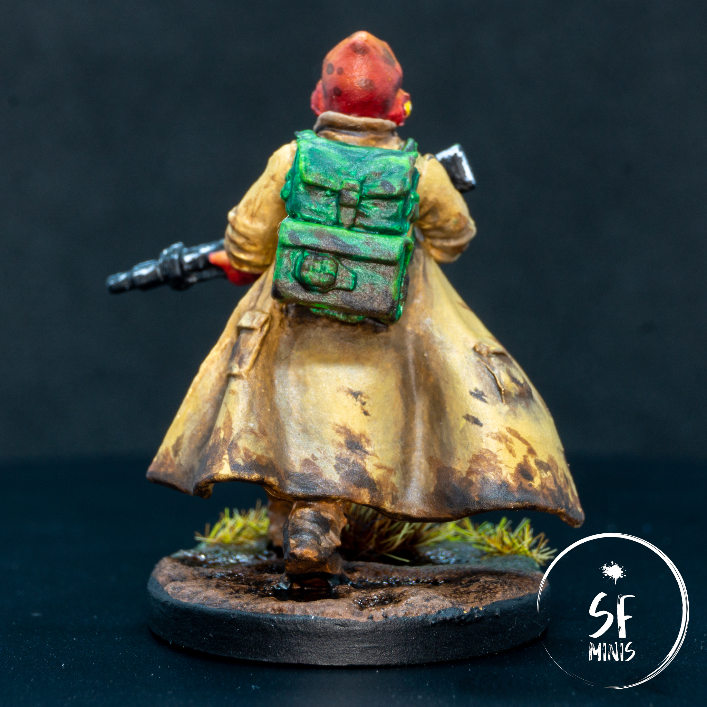

Right from the start, painting Loku intrigued me. The skin tone is something completely different from what I've painted in the past, including the skin imperfections that are characteristic to the species. Also, I haven't had many chances to paint vivid green tones on cloth, and the yellow-y beige of the coat was a first as well. But most importantly, I was curious to see if I could reproduce the "dirty" look of the original art, to show that Loku would not be scared to walk or kneel in mud to hit his targets. I think I nailed the effect and it turned out pretty good! The addition of a mud base brings everything together as well and helps to sell the effect nicely.

Let's see what steps I've taken to get there.

---

Contrary to how I usually proceed, I decided to paint all base coats at first, and shade/highlight/glaze later. The two most challenging colors to achieve were the skin and coat, simply because I didn't really have a pre-made tone for either and I had to nail the mix.

To create the skin, I mixed a dark red with a light brown, which I used as a darker undertone for the areas in the shade. Similarly, for the coat I mixed the same brown with a good amount of ivory and very bright yellow. All the other base colors were just out of the bottle. so the only challenge was to keep it clean and not paint outside of the respective areas.

After the base coat, the first thing I worked on was the skin. I was already happy with the base color as the darker undertone for the skin, so I did not wash the skin further - only some of the recesses in the eyes, nostrils, mouth and neck to give it a bit more depth. For that, I used a dark purple wash and it did the job well.

Then I highlighted the skin by mixing progressively more orange to the existing mix, and applying smaller and smaller layers towards the brightest areas of the head and hands. Once that was done, I painted the skin marks. I took drops of dark brown wash and applied them as randomly as I could all over the skin, with some larger ones on the face.

To bring everything together, I glazed over the layers with two different shades. First, I created a glaze with a similar shade as the base tone, and applied it generously all over the miniature to tone down the layers and dull the skin marks a little. However, that darkened some of the brighter highlights too much, so I also created a pure orange glaze and carefully layered 3/4 thin glazes over the brighter areas, which served to give a nice contrast and bring some light back to the model.

To finish off the face, I painted the eyes yellow, glazed a bit of orange in the lower half, painted the pupils and closed them off with a white dot at the border of the pupil to simulate a reflection. I really liked how it turned out.

---

Next, I painted the vest and boots. As the main theme of the miniature was a rough/dirty look, I simply washed it brown and highlighted the edges with a light brown. I didn't put too much effort into carefully blending the colors, mainly because this way it would get a rougher, older look.

Then I proceeded with the coat. I tried a slightly different approach than I usually do on cloth, and I painted a dark brown in the recesses and folds, with a very high contrast. I then smoothed it over by glazing them progressively with the same shade of brown, until the transition was smooth and had a "dirty" look to it. After that, I decided to use the same process for the highlights, which I painted in a more yellow tone than the base coat. Glazed over some layers and the result looked scruffy and worn out, exactly how I wanted it.

I wanted to take the same approach with the pants and bag, but I found an unexpected challenge: the green tone from Army Painter that I chose for the highlights was just _BAD_. The pigmentation of the green was so uneven that I had to squeeze a quarter of the bottle out (after shaking it properly as I always do!) before some decently-mixed pigment came out. And even then, the concentration was so low that I could basically glaze it over the highlights without having to add any medium. Needless to say I won't be using the same color again.

As a final step, to bring the miniature together, I applied some heavy mud effects all over the miniature, starting with a generous layer of light brown all over the bottom of the coat, boots, bag and trousers, and progressively reducing the area with some darker and darker browns, dotting them over to achieve an uneven and scattered look. As I was already planning to base it in a similar color, this effect turned out really good and I think it sold the main vibe of the character, someone who is not afraid to get dirty to get the job done.

---

I almost forgot to paint the weapon, which is why I decided that I didn't want to spend too much time on it and I simply edge-highlighted it in white to simulate the reflections from the sun. I know I probaly could have spent more effort on it, but I didn't really care for it as much as the rest and I thought that even with this simple step, it already looked good enough to me.

Last, I applied some Citadel mud effect, carefully creating some puddles, and to make it more interesting I transitioned it at the front edge to a grassy look. I applied a couple of dark brown washes and some rough highlights in the same colors as the mud on the miniature, and finally applied a glossy varnish on the eyes and the puddles, to simulate the effect of a rain-soaked ground.

Overall, this is one of the paint jobs I'm most proud of. I really like how everything ties together and even if I cut a few corners here and there, the result is still above my expectations and will look fantastic on the table!
