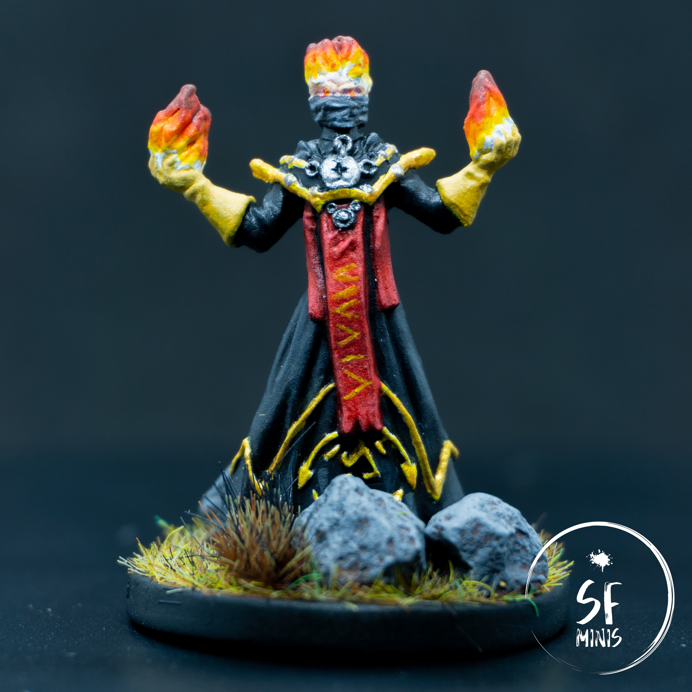
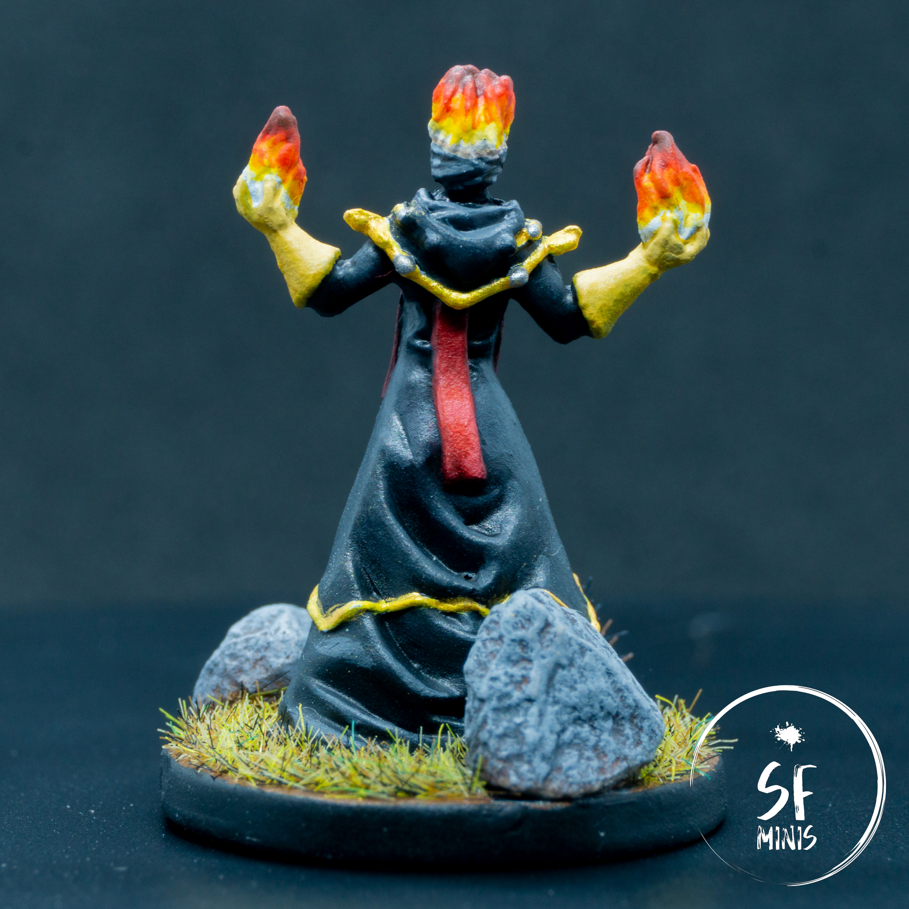

This week's villain is none other than the infamous Lord Merick Farrow, the corrupted sorcerer!
He's the main foe in our current campaign from Road to Legend, Kindred Fire, and he's already proven to be a formidable adversary even to our meticulously picked heroes.

In terms of painting, there wasn't much new or exciting about this miniature. The only thing I wanted to experiment with was the fire effect, but even then I admit I didn't push it too far as I didn't want to risk it with things like object source lighting or any other light effects. Overall it took me a little over 4 hours in total.

---

I began with the robe. It's tricky to give depth to black clothing, as it's easy to start too dark and then struggle to build proper contrast and volume. In hindsight, I could have probably darkened the recessed areas a bit more, but I think it's turned out ok given that I didn't really want to give it too much vibrance and take the attention away from other elements of the mini. The process was quite straightforward, starting with a base coat of dark grey, followed up with a couple of diluted washes of contrast paint, and then progressive highlights in lighter grey.

To make it simpler to paint the golden and silver details, I first gave them a coat of white, then yellow. This provided them with a bright underlay and it allowed me to only have to pass two thin coats of metallic paint and still retain a yellow-y tone, without getting crazy with layers over layers which would have probably been riddled with mistakes.

Then, I painted the red sash. Since there weren't many ridges, instead of the usual process of base coat + darker glaze + highlights, I decided to start from the darker tone and build up the contrast. Instead of adding white to the dark red, I progressively added a lighter red and, for the final highlights, a bit of pink. As for the runes, luckily my hand was steady enough and the tip of the brush did not play any tricks on me, and I was able to get them in a single pass without any errors!

---

The last things I painted were the gloves, face and fire. Honestly, the face on this sculpt was all but perfect: I think on these earlier models (I believe I purchased this one back in 2013) the plastic was a bit too soft and the mold did not allow for the finest level of details. As a result, the eyes are all over the place, and after I tried to paint the horns in a different color, I then decided to just merge them with the fire as they were just confusing to the viewer (as per my girlfriend's opinion at least!)

However, painting the fire was fun. To date, it's probably the most realistic fire effect that I've been able to achieve, and all it took was some layering from white to yellow, orange, red and finally brown, with some middle steps in between these colors with a more diluted mix to give them a quick wash in the recesses.

---

In all honesty, I struggled to find motivation during the week to finish this project. As much as I like painting, I probably will need to take a break soon and recharge my "creative batteries". I am also a bit unhappy by the slow progress I am making: yes, I am becoming quicker, but I don't achieve the improvements I would like to see in my final results, and I often run out of patience and rush the job instead of taking my time to make things cleaner, or blend colors better. I am also probably tired of just painting Descent minis: maybe I should pick up a different game? Thankfully, I've got something like 5 new games coming up in the coming year, so I definitely won't risk running out of plastic!
