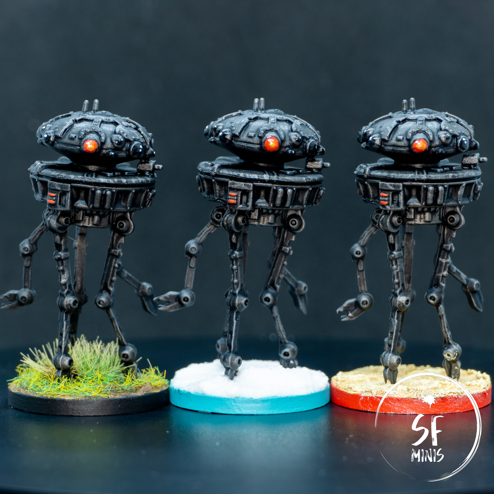
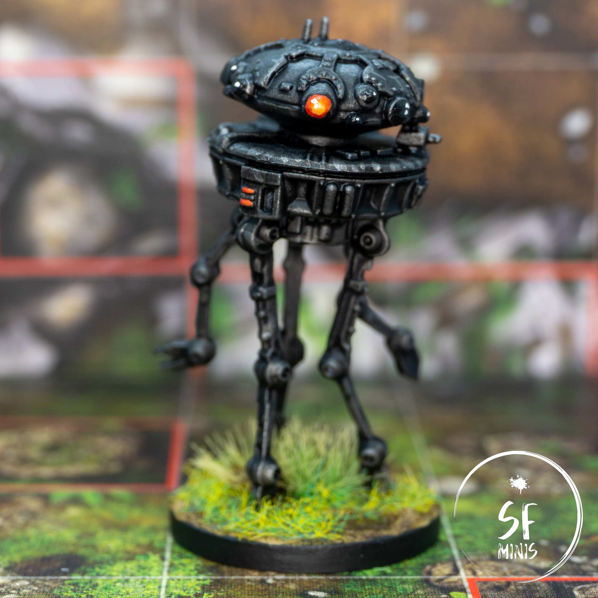
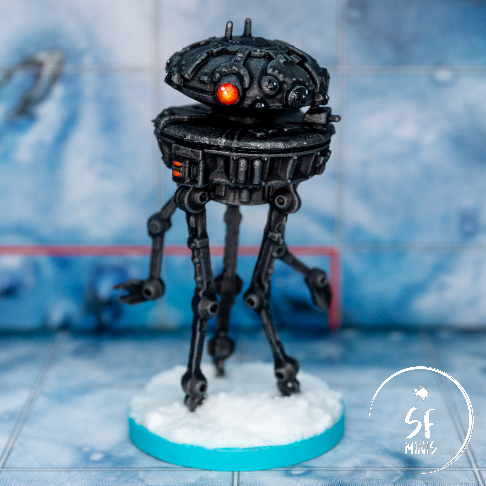
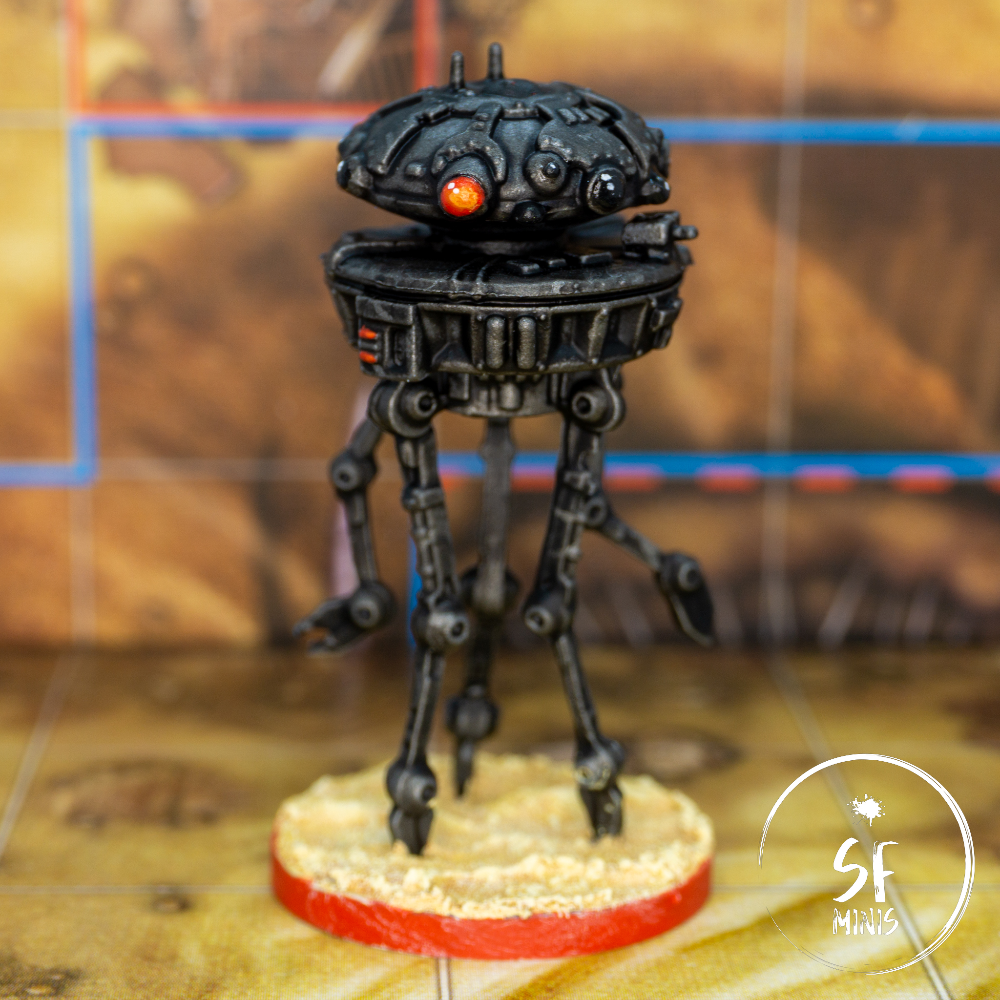

Earlier this week I took on these stealthy and dangerous droids. They can cause serious damage to the players if they get up close and explode, and they come up fairly often in the game. Also, they were **VERY** straightforward to paint, which was a nice change of pace from the complexities of [object-source lighting](/davith-elso/) or [non-metallic-metal](/shyla-varad/). I actually think I spent more time thinking how to set each group apart from the other, and giving them distinct bases, than I did on the main body of the miniatures. Even so, I think the result is fantastic. I closely followed [Sorastro's YouTube guide](https://www.youtube.com/watch?v=-WPJ1r8ztLo) and although my version turned out darker (by design, for once!) his steps were very easy to go through.

---

Starting from the basecoat. I primed the entire miniature with Army Painter's Uniform Grey and, once dry, I drybrushed a mix of black and gun metal on the edges. After two generous dark washes, the miniatures already looked great. They had a distinct black-ish tone, but with a metallic undercoat that showed when light was pointing directly at them. To make them even better, I added some edge highlights and scuff marks, subtly so that they would not distract too much, and called the body done. It was honestly really simple.

The next step was painting the eyes. I decided to give them one red eye, inspired by Hal from 2001: A Space Odyssey, starting with a darker red and progressively adding lighter shades of orange towards the center; the remaining eyes were painted black. Last, I gave them one or two white dots to simulate the reflection on the lenses.

---

I was not sure how I would set each group apart from the others. I thought of a few ways, from lighting the tone of the body, to glazing it red/blue and giving it a different "aura", but they didn't seem right. So I decided to make the bases very different from each other and use these as the distinguishing factors.

The first droid was based with a muddy/grassy mix, similar to what I imagine Endor would look like. I just laid out the texture paint, waited for it to dry, washed it a couple of times and put some grass and tufts on top avoiding the larger pools, which I imagined to be more fresh mud.

The second was even simpler. I wanted to place one of the droids on Hoth. So I just slapped as much snow texture on the base as it would fit, moved it around a little, and the job was done. I am really impressed with Citadel's snow texture paint, it could not look better!

And finally, I completed the set by "sending" the third probe to Tatooine. This was a bit trickier because I haven't really been able to master the desert sandy look yet. The problem is that the dunes should be fairly regular, with one side smoothly sloping down into the base of the next dune, and the other side breaking more abruptly. However I found this difficult to achieve and the result didn't look like what I wanted at all. Still, I could work with it, so I just lightly washed it, feathering the upper areas, and then just dry-brushed lighter shades with an ivory-orange mix until I was happy with the contrast.

---

In the end, these were quick and easy, and they were a good training ground for some base effects that I haven't had much experience with yet. Next up will be another hero, the deadly Mon Calamari, Loku Kanoloa!
