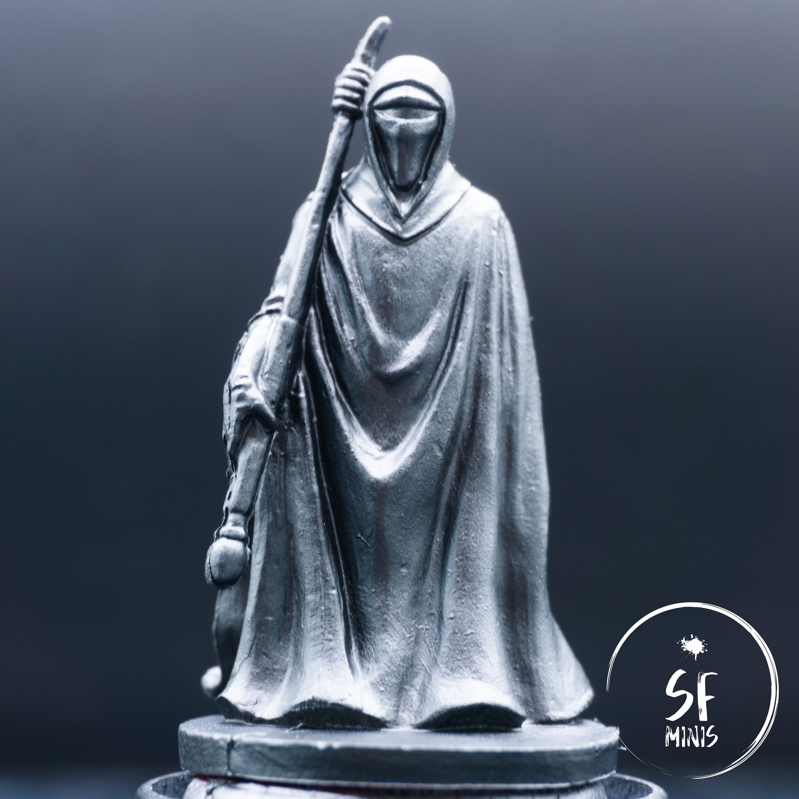

Weirdly enough, we haven't encountered these miniatures that often in our campaigns on Legends of the Alliance. We crossed paths with them a couple of times between the tutorial and the first mission of the main campaign, but never again afterwards. Regardless, I decided they would be my next project as I was tired of seeing them so sad and unpainted.

In the past, especially before I started the blog, I painted more than a few red capes, clothes and drapes in general. So I've become quite accustomed to this and I think it's one of the colors I'm most familiar with. And as it had been some time, the Royal Guards were the perfect project to take my mind off the daily grind and try out a couple of techniques I haven't had a lot of experience of yet.

---

Since I wanted to give them the attention they deserved, and not rush the job, I tried a new approach that I saw other painters use: after priming the miniatures black, I snapped a few pictures in my light box, with the light shining from above (which is the light angle I was aiming for anyways,) and edited them in Lightroom to crank up the contrast to the max. This way, I was able to see very clearly what areas were supposed to be in the light, and which in the dark, with all the shades of grey in between. I usually skip this step and rely mostly on zenithal highlights and my own intuition (which, admittedly, is far from good,) so this provided a very useful reference to give the colors a natural look.

I then proceeded to complete the zenithal priming with my new Citadel Grey Seer spray. Side note here: as I was used to Army Painter sprays, Citadel are a definite step up. However, Grey Seer is definitely brighter, which is something to keep in mind as it will also mean more contrast out of the box.

The next step was to lay out the base color. I went with a very pure red, as I wanted the result to look bright and on the orange side of the scale. This meant that I would not have to darken the recesses excessively and I could rely on the zenithal highlights to provide some basic shading. While this worked (to a degree, as we'll see later,) I then found some additional reference pictures online of people who painted their miniatures on the darker side of the scale, using the pure red as their highlight and darker reds to basecoat the miniatures. I have to admit I prefer that color scheme now that I've seen it, but it was honestly too late to change everything when I found it, so I just finished them as they were.

After three thin layers, the base coat was done and I could proceed to shading the folds of the capes. A little side note here, the opacity of Army Painter's Pure Red is really bad. It's a great color to use as a layer, but it's quite garbage as a base color as it takes a lot of efforts to make it opaque. Somehow I remembered it behaving differently in my previous projects (maybe I thinned it down less?) but I was surprised by how "frustrating" it was to achieve a decent and even color even after multiple passes. Anyways, I approached the shading using a mix of layering and glazing. Following the contrast reference and the zenithal highlights, I started with a couple of darker red glazes, reducing the area in the second pass. Next, I darkened the color further and directly applied a full layer in the darker areas, after which I applied another glaze of the previous, lighter color to blend the two together.

---

With that out of the way, I proceeded to highlight the raised areas. I took a very similar approach, although I first applied a base red glaze to most of the miniature to blend the colors further. Then I layered 3 progressively brighter shades of orange, reaching the peak on the folds that were basically perpendicular to the light source.

I was not entirely satisfied with the result, though. They looked too orange and bright, even for the result I wanted to achieve in the first place. To bring them down a bit, I glazed over them with the base red again generously, which toned down the highlights and brought the colors together. Finally, I applied another very dark glaze (using the darker shade of red) to the inner folds to bring back some of the lost contrast.

---

Once I was satisfied with the result, it was just a matter of appliying some last touches. I painted the staff with a mix of metallic and black (giving the latter a white reflection on the ridge.) I painted the visor black, the ground with a dark metallic, primed and finally applied a couple of coats of gloss varnish to the helmet.

I think I spent more time on these than it shows; regardless, I was actually pretty happy and relaxed while painting, more than most of my latest projects. Not that the previous ones stressed me out, but I definitely enjoy painting red cloth more than white armor. And now, I just hope that the app will put them on the table in our next campaign!
