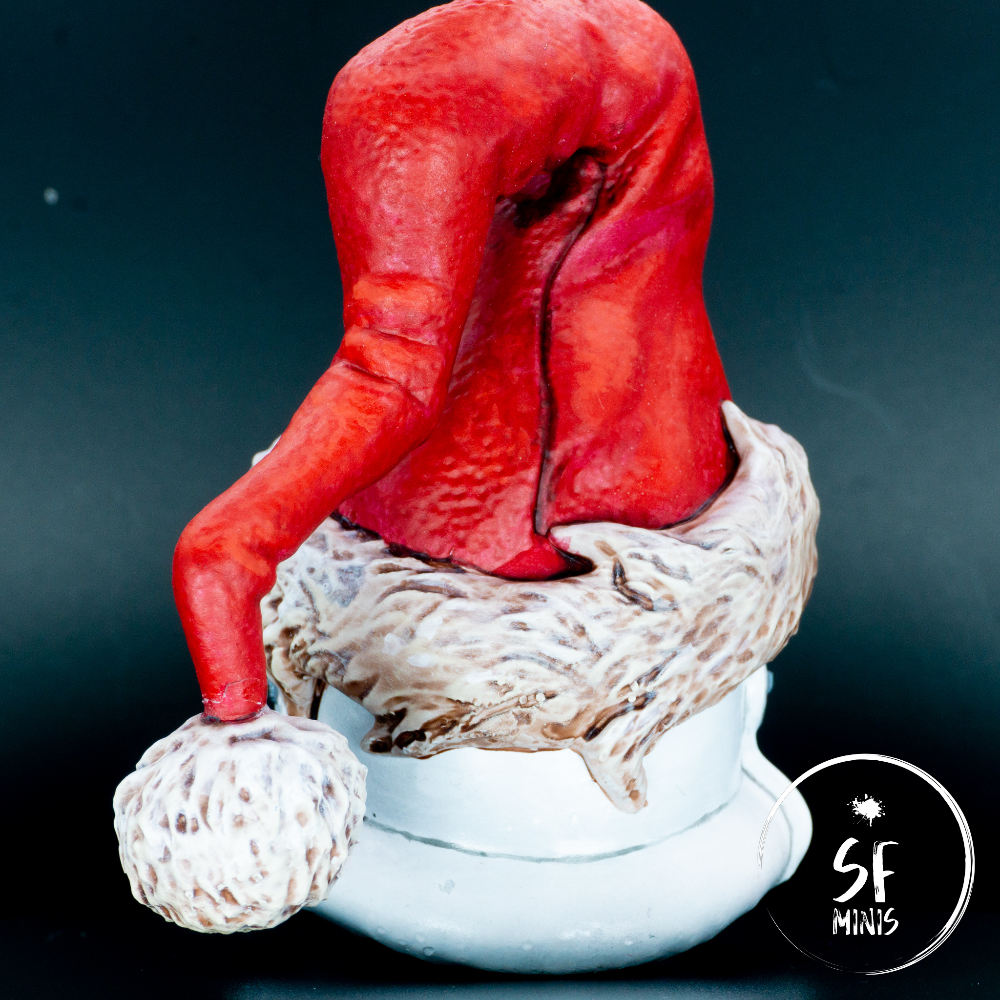
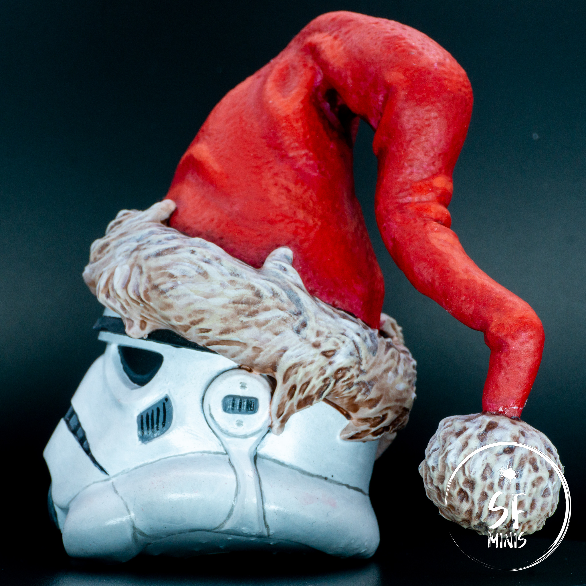

Here I am, sitting at my desk, almost 7 months after my last post. I will say, after a long hiatus, that I am definitely rusty! It took me nearly 2 hours to create the images, video and this post alone.

But it's definitely worth it.

Today, I painted a Santa Trooper. This was a lovely gift from my sister who 3d printed the model and gave it to me. So I wanted to have a bit of fun with it! Technique-wise, this was not a terribly complex or difficult project, so I won't delve too much into the details, giving a short overview instead (if you are interested in other details on painting troopers, I've covered it pretty extensively [here](/stormtroopers), [here](/jet-troopers) and [here](/snowtroopers)).

In this post, I will instead highlight a couple of challenges that I faced which were more specific to this project.

---

For starters, as I had not painted in quite some time, it seemed as if I had forgotten everything. It took me long to get back into the groove of priming, basecoating, highlighting and finishing up with the last touches.

One thing that I wanted to try, and was not entirely successful with, was using the new Citadel spray primer that I had bought a few months ago. I used Corax White, which is a shade greyer than the Army Painter one I've been using in the past. I was hoping that I would be able to naturally create a zenithal effect, but I was not able to get it to work. I tried to only layer up with a brighter white the spots that were hit by the light more, but in the end, it did not make much difference and the result looked a bit dull.

To compensate for it, I decided to pass some of the recesses on the helmet with a thin line of wash, to make the two sides "pop" more. I had already used this effect on my previous troopers, but in this case, with the scale being much larger (more on this later), it was actually an easier and cleaner job to pull off.

---

Other than the helmet and the black parts (which I highlighted progressively in grey), the other main part was the red hat with fluffy fur. For the cloth, I built up from a darker red to a lighter orange, and while I could have probably increased the contrast much more, I did not want to overdo it.

As for the fur, I basecoated it in a brownish-beige colour, then washed it with a light brown and then progressively highlighted it in beige and white. Standard procedure, really.

---

The second challenge I faced was that of scale. I had never painted anything bigger than 3.5mm scale, and this was definitely on another level. Some of the challenges that I had faced with smaller miniatures were not applicable here (such as very tiny detail or precision work).

However, I could also not use many of the tricks that I usually take advantage of with smaller miniatures. In these cases, the scale makes it unnecessary to blend precisely the colours, whereas with a larger model, it requires more precision on that front and a smoother transition between shadow and light to make it seem more believable. I don't think I fully achieved the effect I was going for, but this made for some very good training.

The lack of contrast is also more evident on a bigger scale, as the miniature looks more detailed and life-like. I definitely could have improved it on this front too.

---

In the end, this was a fun project that I must thank my lovely sister for. I had fun painting it, didn't stress too much over the result, and it will make for a nice addition to my Christmas tree from now on as a bauble!

See you next time!
