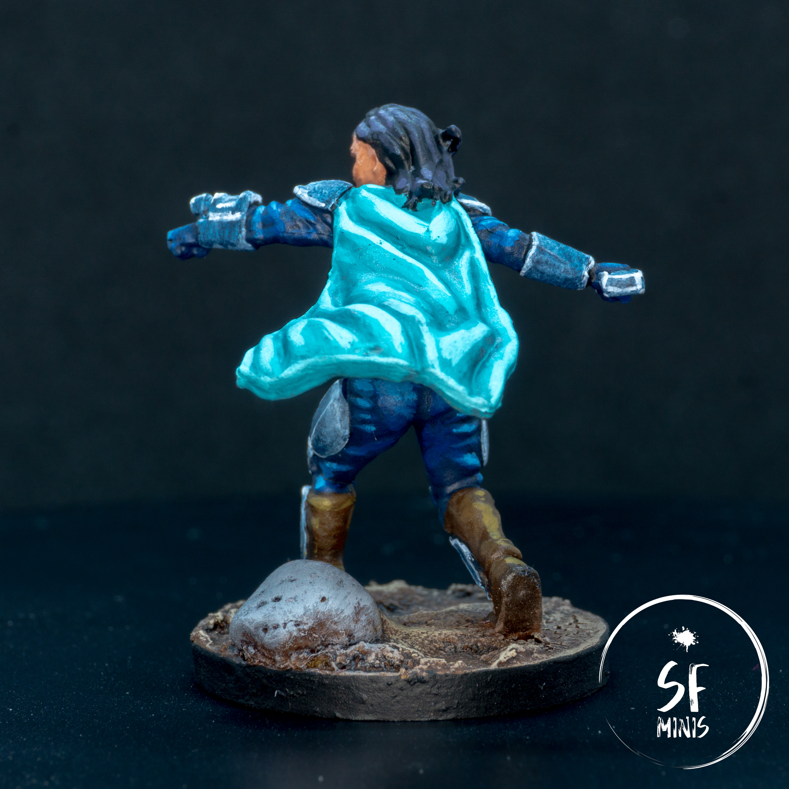
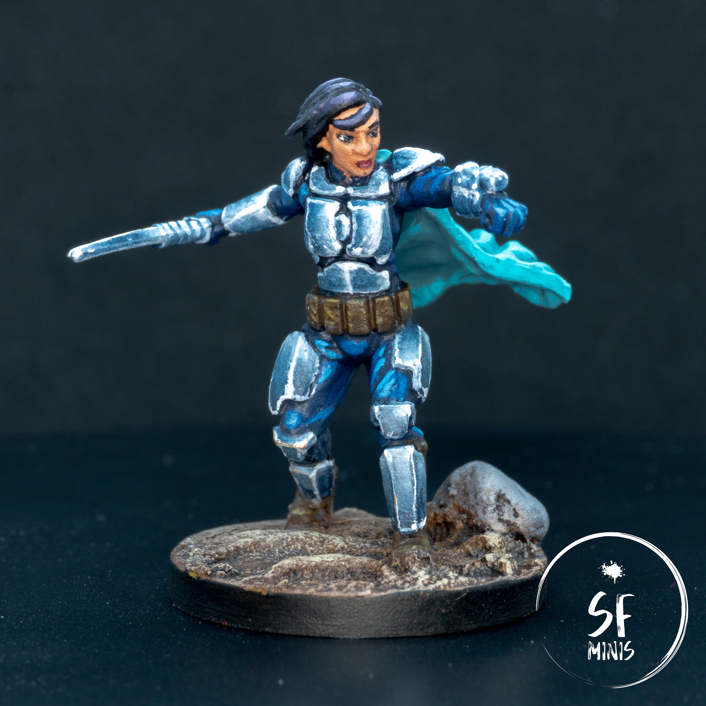
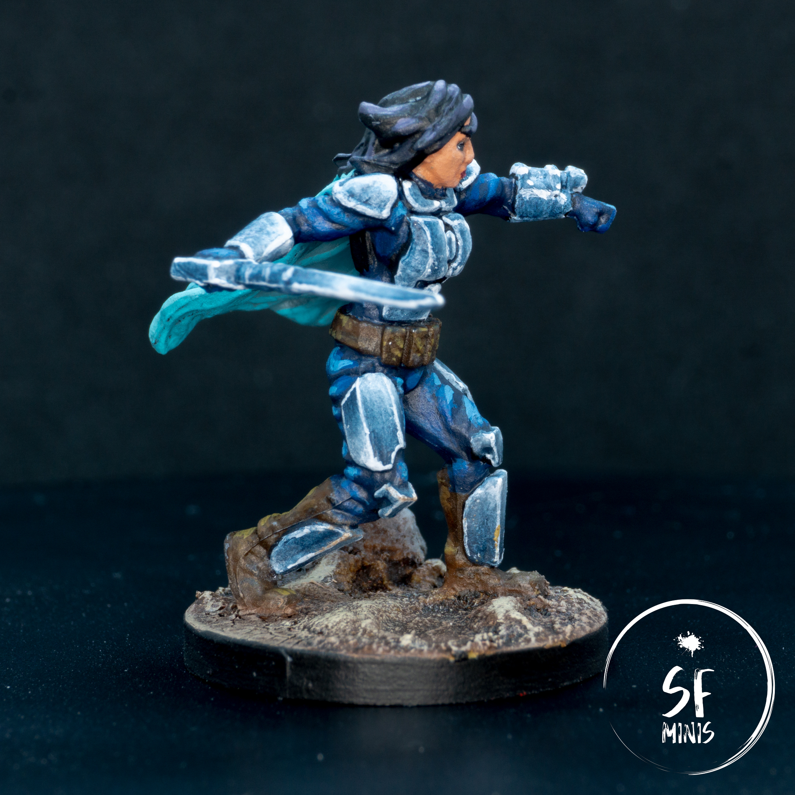

As we near the final Descent campaign missions with my group of friends (we will probably be done within the month,) I am now under increasing pressure to bring a painted set of heroes to the table for when we will eventually start our first Imperial Assault Legends of the Alliance campaign. We decided to go with Jabba's Realm as we love the theme and it seems to offer quite a bit of replayability, with 5 main stories out of 8 to be run through in a single campaign. I am really looking forward to it, since the only time I've played IA has been as the imperial and I honestly found that to be OP compared to Descent. I welcome a challenge!

So, this week I decided to start painting our heroes and I picked up Shyla Varad. The miniature is nice, who doesn't love a Mandalorian? It requires a good mix of challenges vs familiarity in the way I will paint it. Also, my girlfriend will play her, so I was very motivated to give it my best shot.

---

I started from the cape. I think in this case the sculpt is not perfect, as the thickness of the cape is quite unnatural (it's basically a brick's depth!) However, given a zenithal undercoat of black and grey, I simply painted a couple of thin coats of light blue, and built up progressively on the raised areas. On the underside of the cape, I just gave it one fewer coat and highlighted it less, and the zenithal base coat did the rest.

After that, I painted the blue clothing between the armor plates. I followed a similar process, with a thin base coat, some glazes in the recesses, and highlights back in the raised folds. Nothing fancy really, going back to the true-and-tested way of doing things. Looking at it from the pictures, some of the highlights may be too high and not really blended well.

While I was at it, I also painted the armor black, thinking that it would offer a good base from the NMM approach I would take on it afterwards. As we'll see, that was a mistake.

---

Next up, I painted the face and hair. In both cases, I followed a similar process: started with the base coat, and highlight up. On the face, I actually wanted the miniature to have a tanned look, and I initially pushed the highlights too high. After I realized that, I dulled them down and adjusted them. I could have pushed the contrast more, but I didn't want the face to take too much attention away from what I considered the main part of the miniature, which is the reflective armor. Also, I am still not 100% confident when I paint faces, as I must improve my brush handling with small details and find a better way to build up volume without making all miniatures look like males (which admittedly she kinda does!)

As for the hair, I started black, and progressively added purple and white until I was satisfied with the contrast and reflection. I think this is probably the first dark-haired hero I've painted in years. Also, I know that the reference image doesn't really have purple hair, but I wanted to give it a bit more character than just lighting up with a normal brown.

---

Then, it was time for the big challenge: the NMM bits! This was the second time I actually tried NMM seriously (and the first time went so badly that I didn't even publish it anywhere.) Funny enough, both were my girlfriend's heroes, so she definitely has a type when it comes to choosing her avatars!

One thing I should have done, and did not do, was to take a picture with the black paint and a strong light in the orientation I wanted, to give me a reference for where to paint the highlights and dark areas of the NMM. That would have definitely helped, but instead I resorted, for my first try, to my ingenuity and artistic sense. It is now apparent that I sorely lack both.

In this first try, I painted up from the black, wet-blending white and creating a gradient of grey. However, this approach had a fundamental issue: It looked **NOTHING** like metal. Even adding white spots of light and edge-highlighting it didn't help. I think that's potentially because I left the dark areas too wide compared to the bright ones, and their positioning was not realistic. Additionally, I believe the colors were wrong. So yeah, basically I completely flunked it.

So I went back to the browser and started googling images of the Mandalorian, and what I found actually helped me realise these mistakes. I decided to change the ratio of light vs. dark color, the placement of the highlights, and the colors. For the latter, I actually used the color picker in the browser dev tools to check the hex color of each part of the armor (bright light, light, shade, and dark), compare it to the closest Citadel or Vallejo color using [this website](https://encycolorpedia.com/) - unfortunately no Army Painter comparison there - and then compare the result with the closest Army Painter color using [this comparison table](https://redgrimm.github.io/paint-conversion/index.html). Last, I would take that hex color, and compare it to the original color in the picked to see how divergent it was from the original. Turns out, a blue hue looks like a more natural mirror on a blue cloth than just a grey one. Who knew!

Needless to say, I did my homework this time, and I think it looks better compared to the first attempt, even though I still haven't cracked the NMM recipe.

---

In terms of how I approached it, I actually rebased the armor with a light blue, then glazed carefully over it with a dark blue to build up the darkness. In some areas I probably went too dark, so I decided to brighten it up by doing the opposite and glazing it with a light blue.

After I was happy with the placement and strength of the highlights, I edge-highlighted some of the edges in light blue, and finished it up by adding a few pure white reflection spots.

I don't think this is perfect NMM by any stretch of the imagination, and I have tons of room to improve, but I believe this second approach was better than the first. I also learned a lot of stuff:

- Do my research - look up colors and highlight placement before starting. I am no artist and I can't make up realism from my evidently lacking intuition.
- On such small areas, glazing is a better choice than wet blending. On one side, I have got much more experience with the former, and I will get better at the latter the more I practice it, but the results are definitely strongly in favour of one approach.
- Even if I have to call a miniature done eventually, I have the freedom to play around with it and start over if I'm not happy. I know this is something I should know all along, but after you've put a lot of effort into a color scheme, and committed the time to painting it, it's always difficult to admit defeat and risk ruining what you've done so far in the pursuit of perfection. A careful balance of satisfaction and pragmatism is tricky, but possible, to achieve.

---

Obviously, I think given enough time and practice, I could improve this paint job exponentially. But I am fairly happy with how it turned out and I think it will look even better on the table, taking on the evil Empire. Next up, I will either go ahead with another hero, or find another group of imperials - I think I'll decide on the spot!
