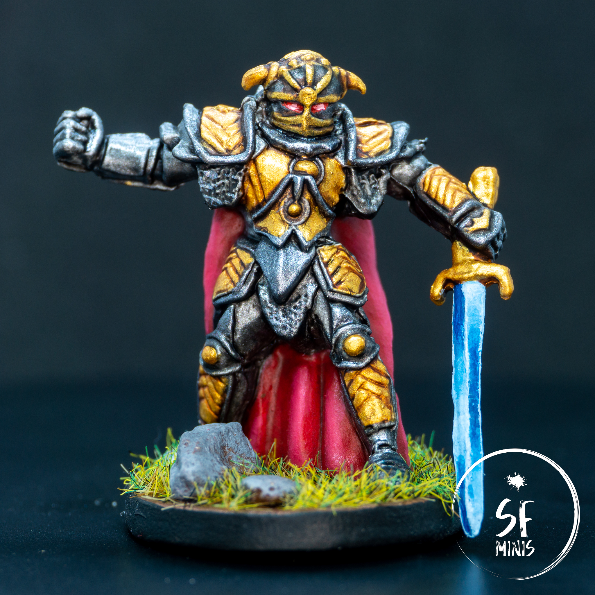
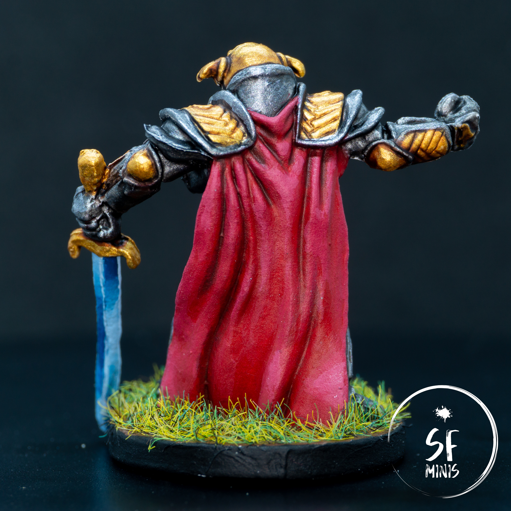

This week, it was finally time for the third and most powerful of the Farrows: Sir Alric Farrow!

I have to admit that I was not enthusiastic about the project. I have probably been painting too many descent miniatures lately, and I've hit diminishing returns in both interest and skill with these models. There are some glaring problems with these earlier minis, some of which I've already outlined in previous posts (like the poor plastic quality and imprecise detail,) which had me basically force myself to pick up the brush.

---

As for Sir Alric, I initially debated whether to try a Non-Metallic Metal approach over his entire armor. I have very, **VERY** little experience with NMM and I thought I would have to start at some point... but the thought of spending all that time on basically 80% of this miniature always put me off. To be clear, this is not a terrible sculpt! I think some circumstances just make it less appealing to me, but I can see how it can be quite fun to try that approach if you already know what you are doing. But I don't really, and I honestly wanted something done quickly, so I decided to try my new Vallejo metallics and boy, did they come through!

Let's start from the beginning: I primed the mini white, because I felt that having zenithal highlights would not really be too beneficial with metallics. It was a good choice as I basically had to just lay 1 or 2 layers to get the colour I wanted.

The armor was honestly pretty simple! Dark silver first, gold second, washes, highlights, and it was done. Nothing fancy there, and honestly it looks much better than anything NMM I could have tried at this stage, for a fraction of the effort. Win! Add to the helmet two glowing red eyes, and the job here was complete.

---

Then, I approached the cape. I've been doing so much red cloth these past couple months that I feel I can probably achieve a good result with my eyes closed, so, to shake things up a bit, I tried a different color scheme. I started from an already-dark base coat, glazed with a darker brown-red in the recesses, and highlighted with a mix of red and white to a pinkish result. Usually, I would add yellow instead of white to highlight the brighter parts, as white tends to desaturate the colors, but I felt like this time it was fine enough to have a slightly duller red given the general brightness of the entire armor.

---

Up to this point, I had spent around 3 hours on 90% of the miniature, so I decided to take a bit more time and try to create a blue "power sword effect" on the blade. There are plenty of examples online, mostly on Warhammer miniatures (the quality of which is definitely much higher than these Descent sculpts,) and it took me a couple of tries to get it the way I wanted. Initially, I tried to layer colors from brightest to darkest, and glaze over them to smoothen the transition, but it just was not working. It was too messy. So I painted all of it white again and approached it by wet-blending the dark blue and white, and that was just on another level. I had to touch it up, amp-up the contrast on some parts of the blade, but after edge-highlighting the blade and separating the two halves with a bright white line, I was actually pretty happy with the result. Not the best power sword around by any stretch of imagination, but good enough for a first try.

---

I will definitely take a break from Descent miniatures for a while now. I have a pretty long backlog of Imperial Assault models that are just screaming to be painted, not to mention a Crisis Protocol Spiderman sitting on my desk, and a lot of new challenges I want to face (like painting big vehicles, or try better OSL with lightsabers). At least, the Farrow family is complete and it will look great on the table when we fight it to the death with our heroes!
