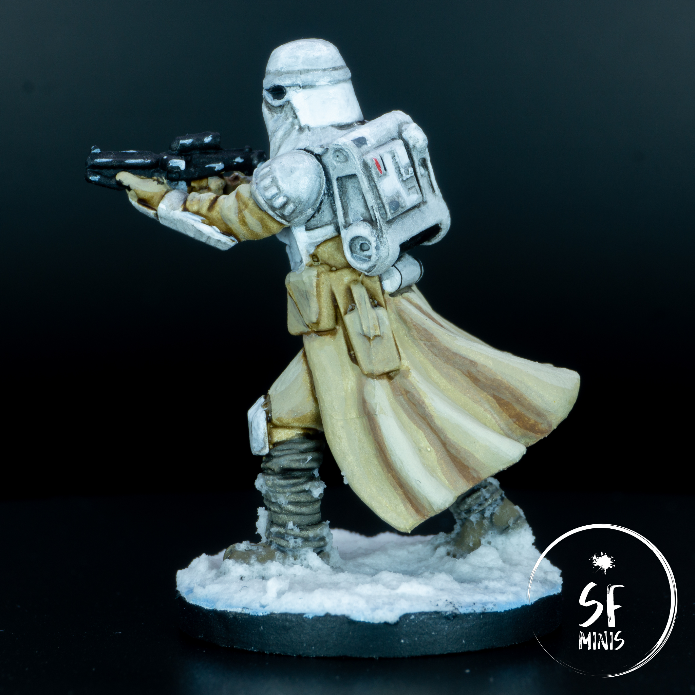
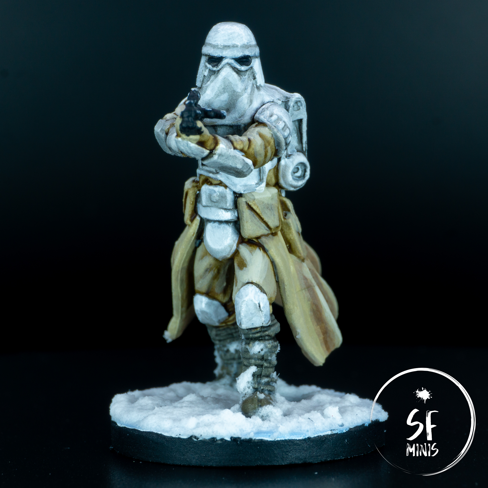
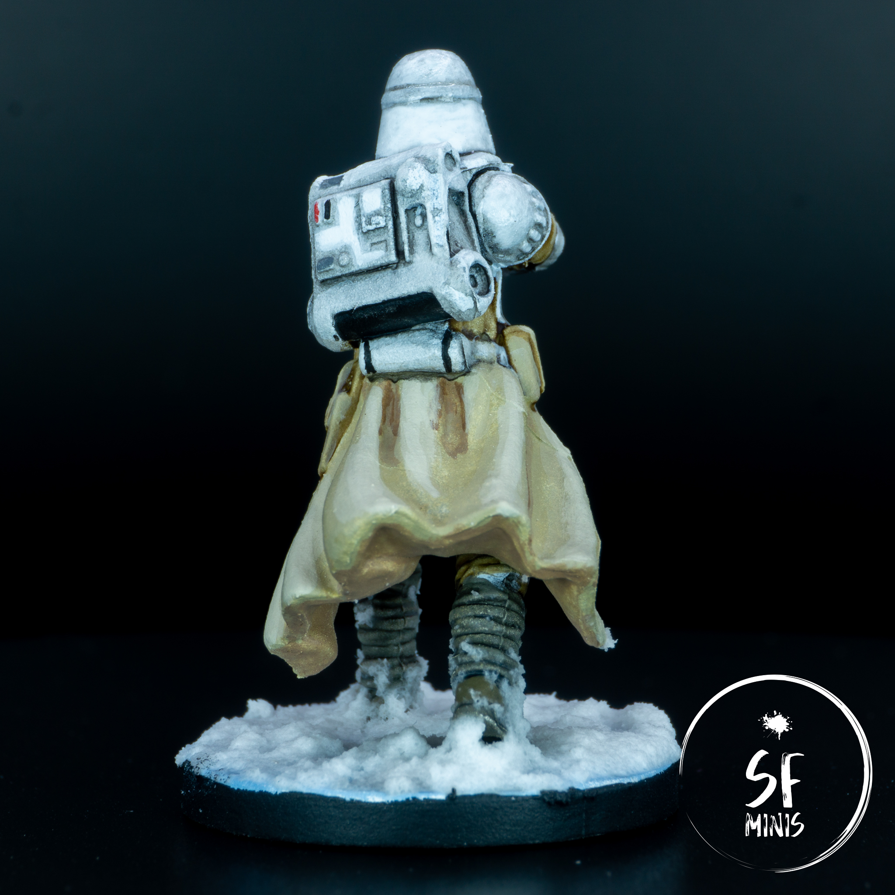

Since our next campaign will be based on Hoth, I decided to tackle one of the least interesting groups of miniatures that I have, and painted the Snowtroopers.

I find it funny that their main color is cream, rather than white - after all, they are supposed to blend in the snow, and I think regular Stormtroopers are probably better at that than they are! Regardless, they provided a bit of a change from regular troopers and I wanted to have the bunch of them ready to be put on the table ASAP, which is why I didn't really spend too much time blending and glazing, but tried a slightly newer approach. Also, I painted these in batch - which was honestly a bit tedious and something I hadn't done (at least, not for more than 4 miniatures) since my first Lord of the Rings army of Uruk-hai, back when I was a teenager. These were the times!

---

Obviously, I primed them white - small side note here, I've decided to drop Army Painter spray cans in favour of Citadel. Even if they don't match exactly with the array of colors I use, the experience with AP cans is just horrible lately, with spotty coverage even after two passes, a nozzle that keeps obstructing and overall paint going everywhere but the miniatures. So long.

I started with the coats. I wanted to follow the movies as closely as I could, so I tried to create a cream/brown look for the textile parts. I think it turned out ok - I decided against weathering in this case because I wanted them to look more pristine.

In terms of the process, I changed it a bit and instead of the usual process of basecoat, wash/glaze, highlight I applied the base coat, then applied a full layer in the recesses, then highlighted the raised areas, and only then glazed between these with two or three rough and heavier glazes. I think the result looks really good on the table (especially since I think I nailed the zones this time,) and less in the pictures, where the rough transitions show more than to the naked eye.

I also applied a dark brown wash to all the other areas casting shadows, and to split up the belt accessories further from the coat.

---

After that, I painted the boots with three color schemes:

- a green/grey mix for the upper part of the boot
- a brown/green mix for the main shoe
- a diluted black wash to bring the two together and add depth.

In this case, I thought about adding highlights, but since they were on the lower part of the miniature, it felt unnecessary and I opted to skip the step instead.

Then came the armor. I knew from experience that painting white armor is **NOT** fun. So I tried yet another approach that showed mixed results.

In this case, after basing again all armor in white (thank you, useless primer,) I proceeded to dilute a black wash in wash medium and water with a rough mix of 1:1:1. I really wanted it to be thin and to only apply to the recesses, which, to a degree, it did.

However, white is still a pain in the ass, and no amount of wishful thinking prevented me from having to go back to all armor parts and re-highlight the central areas that had been darkened. So it took another 2 layers (even 3 in some cases) to bring the highlights back to a state I was happy with. The advantage of this technique is that I could leave the darker areas untouched, and even if in the pictures they look messy (as with all washes on plain surfaces,) they create a decent contrast that looks pretty good on the table, so I'm happy with the result overall.

---

To finish the miniatures off, I painted the weapon, added some rough highlights to it, added some red lights to the front and back, and based both groups. I wasn't entirely sure how to differentiate them other than the ring color, so I just decided to place the elite group inside of the Echo base, with a metallic floor and some snow on top of it, whereas the normal group would be outside still in full snow. The effect turned out good!

After that, I varnished and painted a couple of thinned down layers of gloss varnish to all the armor parts, to make them stand out from other white areas such as the face cover or backpack.

---

In retrospect, these are not the best miniatures I've produced, and that's ok - I wanted them done soon-ish, and they were. The positives (things like the color selection or overall look) outweigh the negatives and I'm quite pleased that I was able to take 6 miniatures off my to-do list in a relatively short amount of time.
