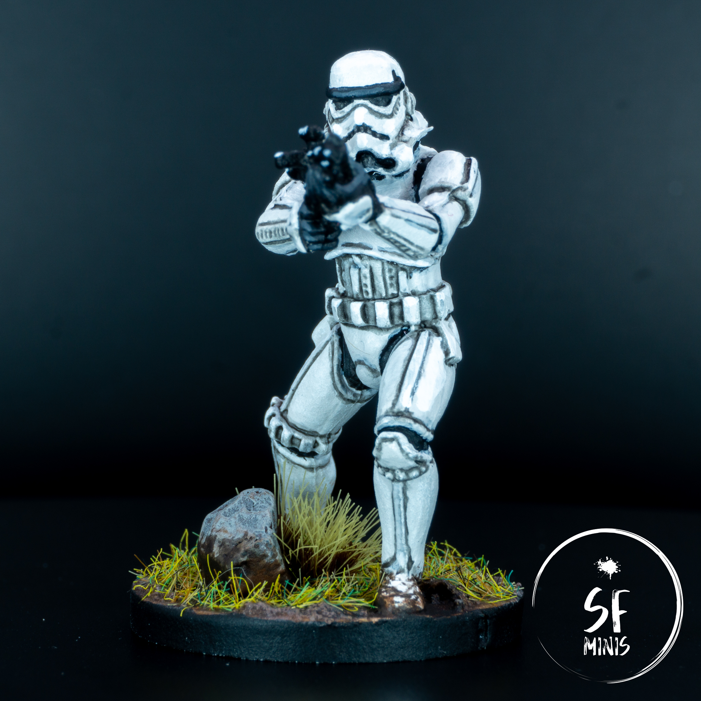
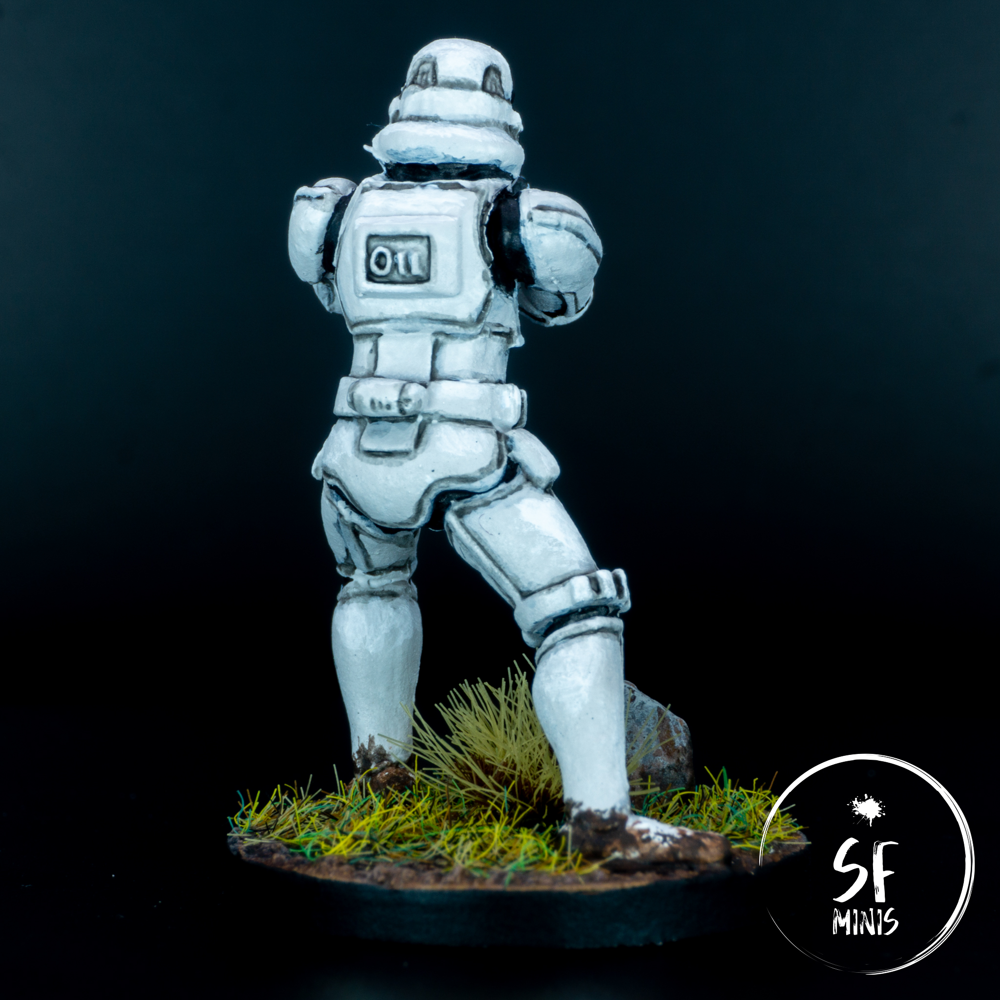

When I first set down to paint these troopers, I had a clear goal in mind: get on with a quick, "dirty" job, and move past to the next batch. Rinse and repeat for all trooper-type minis in my collection (9 stormtroopers, 4 heavy troopers, 4 snow troopers, Captain Terro, not to mention ISB infiltrators and Kayn Somos.) To be frank, I was already unhappy with the lacklustre quality of the miniatures: poorly-assembled limbs, plenty of difficult to remove mold lines, and a generally uninspired pose were evident before I even put them on supports.

Ignoring these issues, I sat down and started painting the first group of 3 miniatures. The plan was sound, and it was all going smoothly. Until I looked at the time, and found out that it had taken me more than 3 hours just to base coat these 3 miniatures and paint the black joints between the armor. Not to mention, I was already bored out of my mind.

So I got up, stretched, cursed at my inability to follow my own standards (more on this later,) and sat down again to complete the job I had just started. So let's see what went wrong.

---

To be frank, most of the process is nearly identical to how I painted the [Jet Troopers](/jet-troopers/), which is why I was expecting to be quicker and more efficent this time around. I started by priming them white, but then I followed one of the lessons I learned recently and instead of moving directly to the black joints, I gave them a base coat in a very light grey. The reason for this is that, quite obviously, it's impossible to go any brighter than pure white, and I wanted to see if I could apply some very basic volumetric highlighting while still retaining a pristine white look. I also recently learned that pure white and pure black are not good choices of base colors because they are very rarely found in nature, and they look "off" to the eye.

Anyhow, after basecoating them grey, I proceeded to paint the black under armor. This is the step that drove me almost insane and completely derailed my original plan. It took me nearly 1 hour for each figure to paint the black parts, and I don't know if I was just having a bad day or if they will always be like this, but I simply could not stay within the lines. My brush kept going off and I made mistake after mistake, which frustrated me more and more. Once I was done with these, I had a choice: I could either proceed to the next step (shading) and leave any touch-ups to later, or I could do them right away. In retrospect, I should probably have done it after shading, as that would also require touching up, but being an idiot perfectionist I thought I could get these done in a pinch and move on to the next step. So I fixed these issues right away.

That set me back another 20 minutes per miniature. It was not as straightforward as I'd have thought: as with any white-ish color, I needed to thin the paints significantly else they would leave a very distinctive "chalky" look. That meant 2 or 3 layers, more frustration, and less and less interest in the quality of the finished work.

---

Then I moved on to shading. Similarly to the Jet Troopers, I very carefully applied a thinned-out wash line to all the recesses on the armor. This step was also **excruciatingly** slow, and it was followed up by another round of touch-ups as anticipated. No matter how precise I tried to be, even the slightest mistake would jump out on light grey. Once I was done, after many a break and intensive longing at the knife on the table to end my sorrow, I looked at the time again and another 3 hours were gone. I was already more than 7 hours in for 3 miniatures, whereas in my original plan I would have already started on the third group.

Needless to say, that was no longer an option. I vowed to finish these 3 troopers the best I could, but that was it - I couldn't do this again. Not for 15 more miniatures!

The remaining steps were actually quite straightforward: I applied some volumetric highlights in white on the armor and grey on the gloves and forehead, and simply added some white reflection on the weapons. Then another couple hours to lay down a grassy/muddy base, varnish, and I called them done.

---

I thought I had learned some lessons from painting the Jet Troopers, but it seems like I fell into the same trap. There's a paradox to my dysfunctional quest for perfectionism: the more I wanted to make them perfect, the more I failed to do it, the less I was entertained and therefore cared about the result. Which meant that I ended up with a, _yes_, decent result, which still left me disappointed, considering the sheer amount of time and effort I put in expecting something much better.

If I ever am to paint their "brothers", I will have to strictly adhere to my own guidelines:

- Don't seek perfection
- Fix mistakes only when I have to
- Concentrate my efforts on the important parts (the helmet mostly)
- A mediocre finished miniature is better than a grey, unpainted one

Who knows, maybe one day I'll learn!
