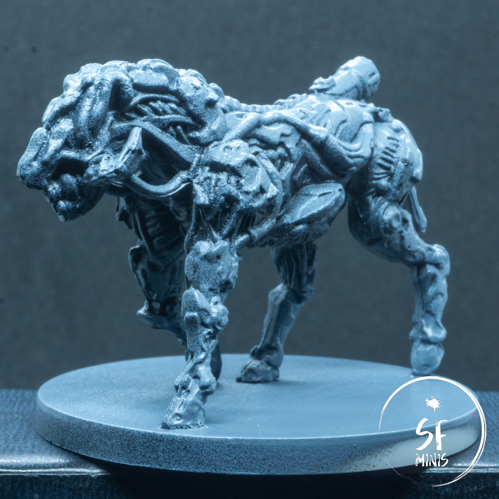
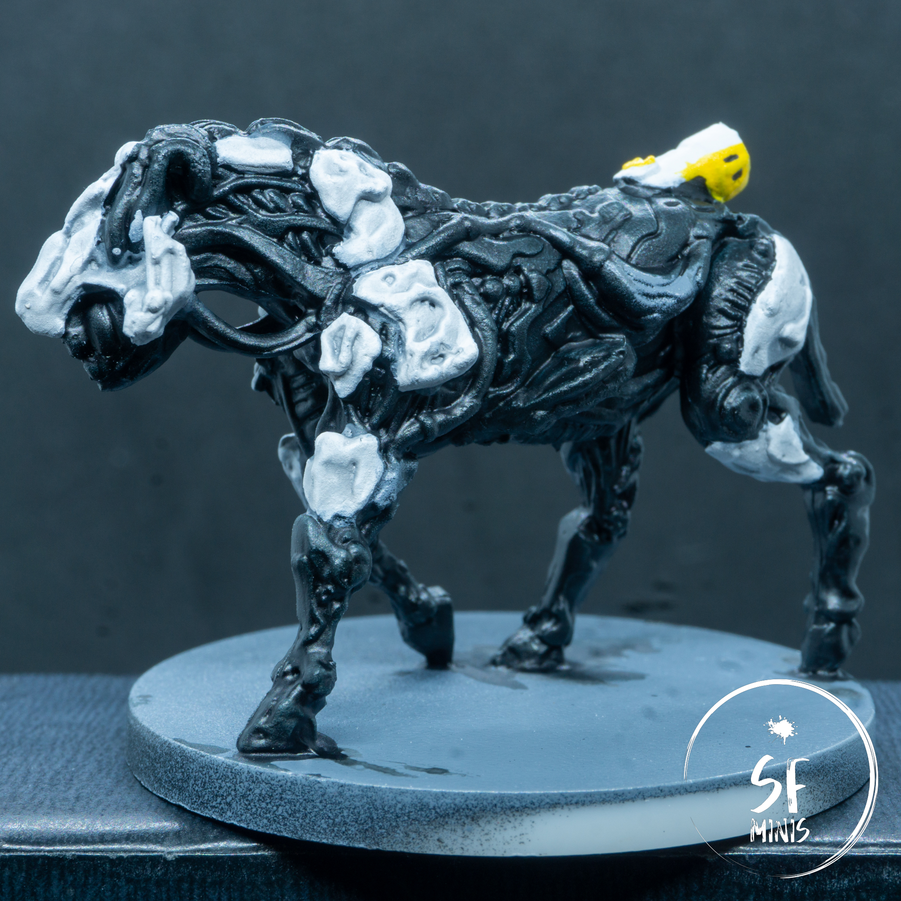
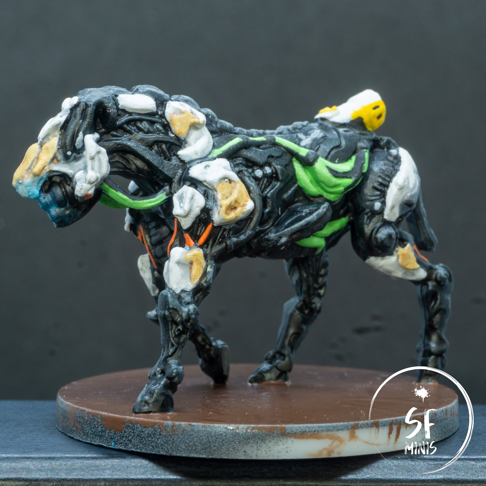
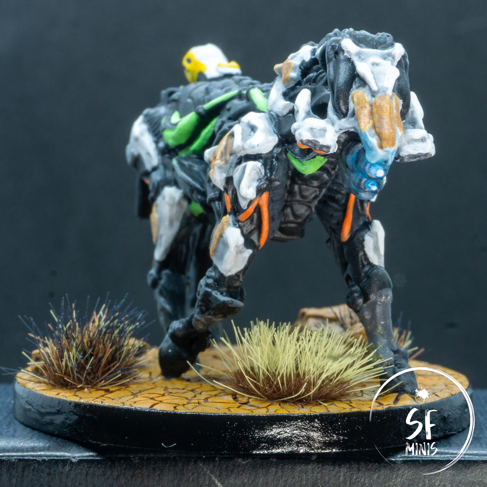

Right from the bat, there was something wrong about these miniatures. I couldn't really put my finger on it, but it was in some ways similar to what I experienced with the watchers, if even stronger.

I started off as I always do, with a black primer and a grey zenithal highlight (it was also pretty humid on that day, so the result was quite misty-looking). I was not sure whether to apply a third, 90 degree white layer, and eventually I decided against it because I had already "botched" the zenithal by spreading it too wide on the miniature. I could have re-primed the black and grey, but I didn't want to risk losing detail to too much priming.

> Too much grey!

Then, even laying out the base coat of black and white took at least twice longer than it usually does. Ok, these minis were bigger than what I had been painting lately, but it was still painstakingly slow and I just didn't "feel it". In terms of process, I applied a thin layer of Black Templar contrast paint over the black areas, and shaded them with a dark tone. Too much of it probably, because it basically turned these areas pitch black. Then I painted the bright beige armor plates and shaded them with a lighter grey, which improved them slightly. Still, I was not happy of how it was turning out.

> Too black!

---

Next step was to add some variation of colour to the armor plates, trying to avoid the mistake I made with the watchers of making the browns and grays too dark - and in retrospect I think I went too far off in the other direction and actually didn't choose a dark enough hue. After that, it was time to highlight the raised edges, and colour the green sacs and orange cables. I then painted the base with the basecoat and added the blue lights to the eyes, adding a bit of object source lighting to the surrounding face. It is probably the part of the paintjob that I like the most.

> Still quite dull to be honest...

After that, the only steps remaining were cracking the base with some Agrellan Earth, dry-brushing it with an orange tint, and adding the stones and grass. Same process as the watchers really, so that was fairly quick and "painless". Then, matte varnish, black on the base borders, three layers of glossy varnish on it, and they were done! Still, I was not as happy as I wanted to be, but I decided to call them done anyways. I had already spent too much time on them and I wanted to move on to something I would enjoy more.

> Basing is not too bad though, and the eyes look quite good actually!

---

So what went "wrong" with these guys? I thought about it for a while, and I think some of the issues I encountered with the watchers were actually amplified with the striders. I can probably pin-point them to these areas:

- The miniatures were not only bigger than those I had been painting previously, but there were also 4 of them. This meant that every small problem I encountered with one, I would likely encounter with all the others too, like having to be extra-precise on some awkward areas on the underbelly, or having to pass 3 to 4 layers of beige on each plate to make it opaque enough.
- There were just _TOO MANY_ details! I don't mind this in general, as it's always great to work with precisely detailed miniatures, but in this case most of them were in the "dark" areas on the armor, which also extended to 3/4 of the entire miniature. Simply put, I had to choose between two options: spending days on each single miniature, making sure that every plate, every recess were finely coloured, shaded, blended and highlighted, or the opposite, not caring about the fine details and painting them to "tabletop" quality that would just look very dull. I couldn't manage to find the middle ground between these two, and the more I tried, the more time I spent on little and unremarkable tweaks that weren't really doing the miniature any good. Eventually I just had to call it and move on.
- There weren't many reference images online to actually look through properly, to find out the colour scheme of the smaller details. Trying to be a perfectionist, I initially tried to make them look as similar to their game counterparts as possible, only to realise that I wasn't really even able to tell if some parts were metallic or matte, grey or beige. It was really hard for me to let go and actually get on with a paint job that wasn't 100% accurate, and I think this is one of the reasons why I am not fully satisfied with the result.

Worse of all, I think these problems will apply to most of the other Horizon miniatures as well. I just can't seem to find a good colour scheme.

---

In the end, as everyone always says, these will look loads better on the table than they did when they were just grey plastic, but I think I am going to pause the robots for a while, at least until I feel I have gotten better at some basic techniques of wet blending and highlighting.

So see you on my next post!
