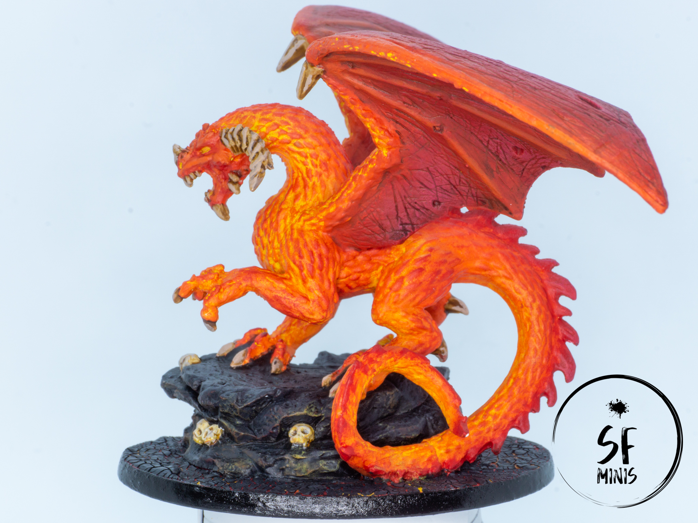
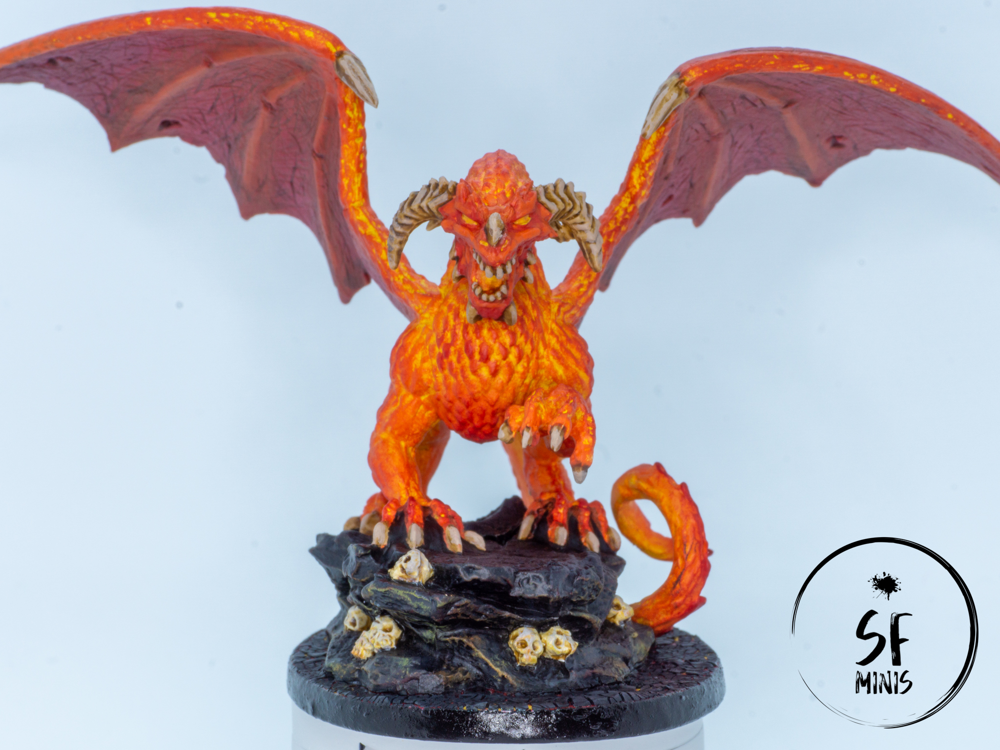
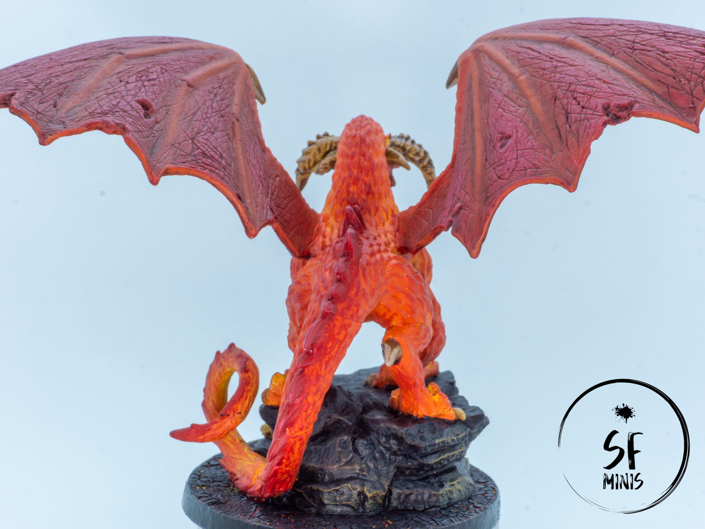
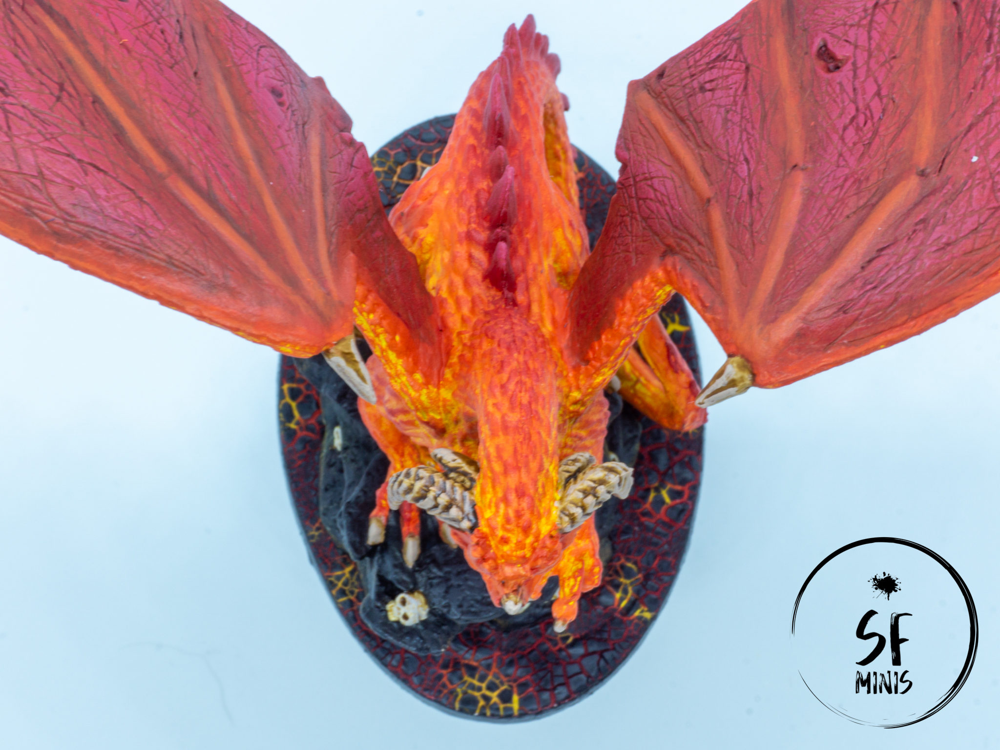

Oh boy, was this mini one I was looking forward to painting! Valyndra, the Queen of Dragons and (in my opinion at least) one of the best scuplts of the game!

I tried a bunch of new techniques and paints on her: some turned out better than others, but I think the result is still one of the best I've achieved in the last few months. I did some research beforehand to figure out the color scheme, how to place highlights and shadows, and generally what types of techniques to use to make her look the way I wanted, which is to say a fiery daemon that's about to pulverize our heroes to ash.

Overall, I think the effect worked. Instead of going with the traditional routine of base coat -> wash -> highlights, I decided to skip the wash altogether and start with a very bright base coat. There were other schools of thought in the images I looked at, which were following the traditional way, and while they looked good, they were focusing more on the scales of the model rather than the underlying skin. The effect I wanted to achieve was the opposite, of something incandescent below an armor of dull scales, so the layer underneath would have to be much brighter than the one above.

---

So I initially started off with a completely white primer, rather than the zenithal black + gray that I usually pick. This was because I wanted to use a very bright yellow on the body, and I didn't want to lose my sanity trying to cover grey or even black areas with 200 thin coats of yellow pigment to achieve the brightness I wanted. I lost on some shading, but I gained big on time.

After that, I painted the body in patterns of yellow and orange. This is the first mini on which I tried wet blending in a meaningful way, and I achieved some of the best results in terms of blending that I can ever remember. It's a bit of a shame that this first layer was mostly covered by the dry brushes of the scales on top of it, but it still shows in some areas like the chest and tail, and I'm just happy I got to exercise with something that's supposed to be very basic but still never managed to get 100% right before.

---

Additionally and to try to add some more contrast to the color scheme, I painted the wings with a much darker shade of red and blended it with the yellow and orange on the front part of the wings. I washed them with a dark red wash, but at that point I realised that I didn't really like the stark contrast between the shades of red and orange that I had picked. To fix it, I began by glazing the wings in orange, further reducing the contrast between the two parts, and progressively made the glazed areas smaller to leave the center of the "skin" between the bones a bit darker. I still wasn't fully happy though, so I brushed a couple of lighter variants of the color until I had a hue I could accept and still gave me enough contrast to play with. The next step on the wings was to paint the bones with increasingly bright orange, and they were done.

On the body, I started by dry-brushing most of the scales in the same orange I used in the previous step. Then I kept brushing with darker mixes of orange and red, scaling that back to the parts of the body that were already orange, until I achieved the effect I wanted. This left the miniature with a really bright core and darker scales the more they went to the bottom of the sculpt.

---

At this point I was 75% done. I painted the dark red spines on the back and tail, blended them with the back and dry-brushed them. Then I proceeded to paint the exposed bones with a very light beige and wash them with contrast paint, wait for them to be dry and highlight again with the same shade of beige. Job done, right?

Well, not really! A nice feature of this sculpt is its huge base, which FFG have already improved with the addition of rock and skulls. It's really neat!

To make Valyndra stand out, I wanted to try something different again. I decided to stick to a mostly black and dark grey color scheme for the rocks, to give them the appearance of dull obsydian, and then I added the final touches to the rest of the base: a molten lava ground!

To achieve that I first painted it with random patterns of dark red, red, orange and yellow. Then, I applied some PVA glue to make it "stickier" for the next step I was planning: using Citadel's Mordant Earth Technical paint to achieve a cracked-earth look! I think in the end it turned out pretty well, the colors of the lava underneath didn't need to be finely blended together as they were only showing through the cracks, and to top it off I tried some light object-source lighting on the underside of the rocks to make it look like the lava was really alive.

---

Overall, I am very happy with most of the new things I tried on the mini. The huge scale of the sculpt helped too, as I don't think I would have been able to achieve the same results on a smaller one. Now, I can't wait to put it on the table and make it fight our heroes to the death in our campaign!
