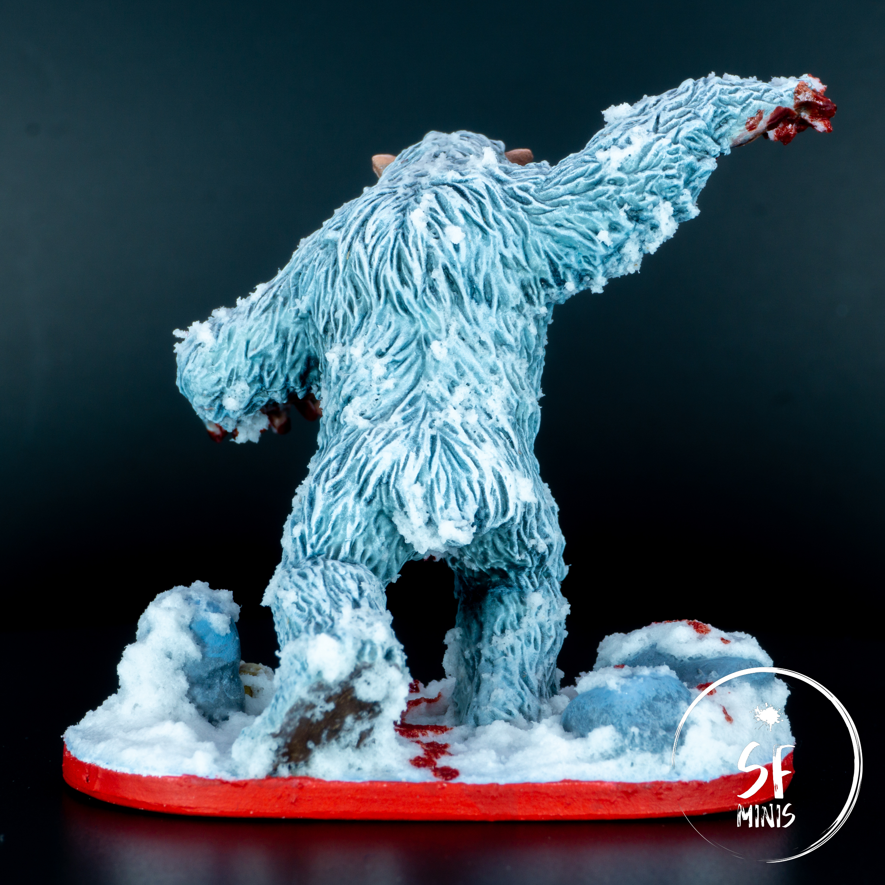
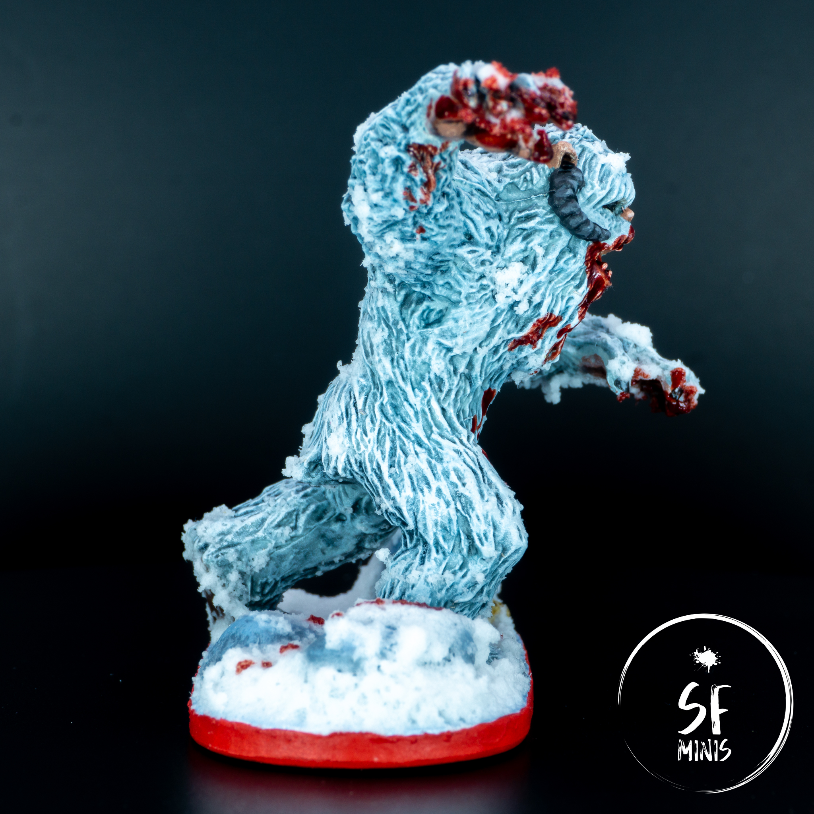
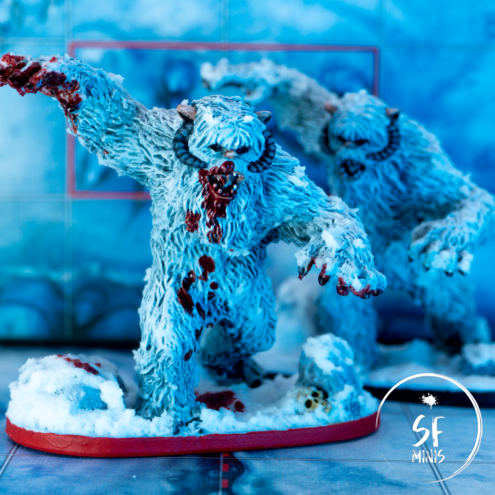

From the sandy deserts of Tatooine to the snowy dunes of Hoth! This week I had some fun painting another model that I was really looking forward to: Wampas!

In game, these beasts are quite fearsome, especially on lower levels, so it never felt right using them grey. Also, admittedly, I love everything Hoth, so they were logically the next step as we will head into the Return to Hoth campaign next with our party of players.

In terms of techniques, I borrowed a lot from my previous work on [Karnon](/karnon/), which is one of the paint jobs I'm most proud of to date. They were not difficult, and instead they actually gave me a lot of space to try out color schemes. I probably spent more time on them than the result shows, but it was fun so that's all that matters. And the finishing touches of the base and blood effects really work well!

Let's go step-by-step.

---

In this case, I based the miniatures first as the initial step. I chose some bigger rocks and placed a skull, so they'd be primed together with the rest of the miniature. I usually leave this last because rocks and basing materials tend to obstruct some of the lower parts of the miniature, and make it harder to paint, but in this case I had plenty of space and they didn't require much precision anyways.

I primed the miniatures white. Little aside here, I'm using Army Painter's spray cans but the nozzle keeps getting obstructed and it's beginning to be annoying. I've never had any issue with other spray cans before, so I'm wondering if I'm doing something wrong? Or is it just the quality of AP cans that's not very good?

Anyways, for the base coat I had two options to choose from. I could pick a color scheme based on cream and warmer colors, which would be more faithful to the actual color of the wampas in the movies; or I could go with a colder, blue hue that was less faithful but more scenic and reflective of the type of climate of Hoth. I decided to with the latter, and coated the miniatures with a mix of blue and light grey.

---

Next, I washed them with a mix of blue and black, and thinned them down significantly to avoid darkening the miniatures too much. I applied two or three coats on the underside of the arms and legs, and most areas not in the light, to crank up the contrast further.

After that, came the fun part. I experimented with irregular dry-brushing using multiple shades of blue to try and give them some volumetric highlights, which worked (to a degree.) I probably should have used an even lighter touch on some of the later layers as they mostly covered the work done in previous ones. I also could have been more brave with the contrast between the hues, as the steps were quite subtle.

Still, I was fairly happy with the result. It didn't show all the work I put into it but it still looked good.

At this stage, to bring back some definition on the fur and crank up the blue undertone further, I thinned the blue wash and applied one or two light coats all over the miniature, carefully making sure that it would not pool and hide the highlights.

---

Once this step was done, it was only a matter of adding the extra details. I painted the mouth and palms with a dark skin tone, washed them, and highlighted them back a little. Similarly, I painted the plant of the foot with a darker brown and washed it in black. To soften the contrast between the fur and skin, I glazed over 2/3 layers of light grey on the borders of the hands and foot, so that it would blend more easily and look more natural.

I also painted the ears, nose and lips with a lighter skin tone, highlighting in one or two steps. Last, came the horns, on which I followed the same process with a dark brown/grey color, and claws, which I painted black and simply highlighted with a thin grey line on the ridge.

Finally, I worked on the bases and last details. I planned to fill both bases with snow, covering most of the rocks with it as well. I painted the bases with a light blue that could give an icy look underneath the snow, painted the skull using ivory and contrast paint, and then proceeded to apply the snow generously, covering most of the base in it and only letting part of the rocks and skull to show through it. Additionally, I applied some snow to the fur as well, simulating both snow and icicles on the whole body.

Once all of that was dry, I painted the rims and varnished the miniatures. But I still wanted to add one last effect: to differentiate the elite wampa further, I applied some blood effects to the mouth, hands and body, simulating a trail of dripping blood on the snow. I was careful not to overdo it, and I think it gives the miniature a lot more depth and realism, making it even scarier!

---

As I said, this was fun. I don't mind going back to simpler techniques every now and then, without having to care too closely about small details, and the results are pretty much in line with my expectations. I may try to do a batch of Wookies soon and see if I can transfer my knowledge to brown fur as well!
