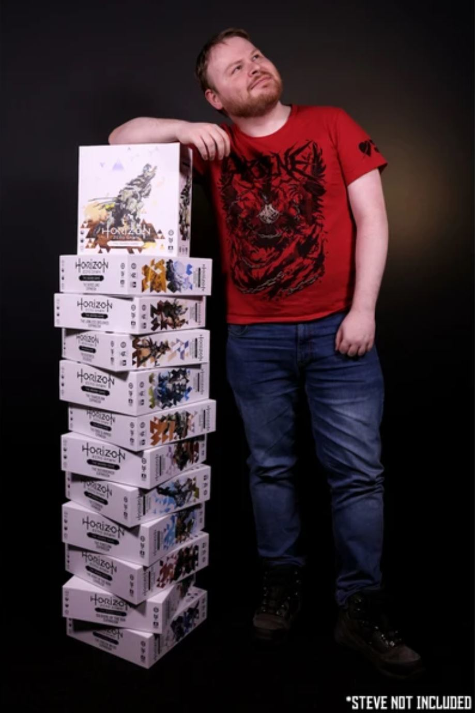
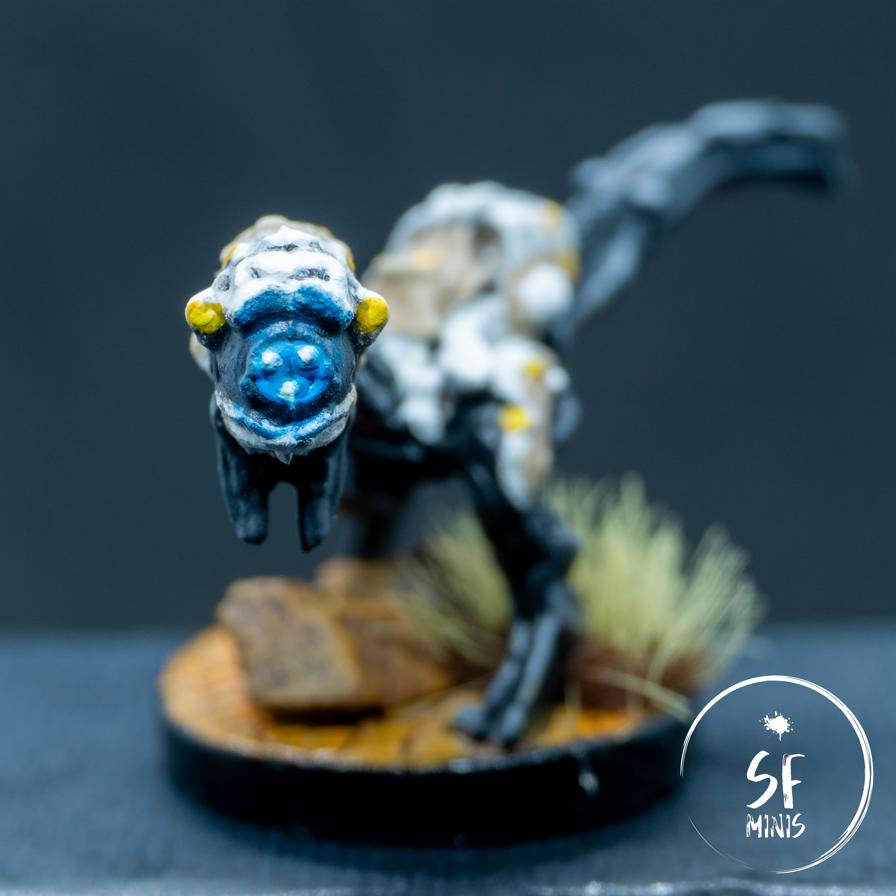

Today's post is a departure from the fantasy setting I've discussed so far, venturing into the world of Horizon Zero Dawn!

I personally love the setting and lore of the game. I am a passionate player of the video game (currently clocked in 60+ hours and I haven't yet finished the main campaign,) and my lovely girlfriend has gifted me a copy of the newly kickstarted board game.

There are mixed reviews online about the game, and I think I mostly agree with them. The base game is merely a tutorial: we played it once and it was extremely simple to beat. Additionally, I'm a bit worried about the replayability of this first mission, as it can already get a bit repetitive from a single campaign run.

That said, however, the miniatures are _GORGEOUS_! They are cast in a harder plastic than other games like Descent, and the result is a lot of very fine detail showing on the miniature. It was never going to be an easy job to bring something as complex as these hyper-realistic machines to a boardgame, but I personally believe they have done an egregious job and it really shows in the details.

This is actually really good news for the future, when more and more expansions are set to hit the market and make the game more replayable and even more beautiful to look at on the table.

> Does anyone have some spare closet space for me to borrow?

---

But now onto the seemingly innocuous foes known as Watchers! They are the smallest machines available in the game, so one would be inclined to think that they are not dangerous.

However, their nastiest trait is to alert other enemies of your presence as soon as they spot you! If not kept an eye on, they can cause really massive headaches.

Fortunately, they are quite easy to take down, so any experienced player will know how to deal with them swiftly and precisely.

> As long as the eyes are blue, you're in the clear...

From a painting perspective, they were more of a challenge than I had imagined. I tried to use GW Contrast paints to speed up the basecoat of the dark and white areas of the body, but they didn't really work out the way I hoped so I had to re-coat everything and it generated a bit of a mess.

In the darker areas, I struggled to create contrast, and this is something I need to get better at with the next batch of miniatures from the game. Regarding the white armor, I mistakenly washed it with a brown-ish wash that didn't fit at all the scheme of the mini, which made it look worn out and just plain dirty, not a look I wanted to achieve at all. Again, I had to re-adjust and the result suffered from it.

> That's it - time to strike from behind!

Additionally, I played around with the beige secondary colour on the white armor, going from a darker to a lighter tone, and I don't think the detail on the mini benefited from these multiple coats of paint! I think I could also go even lighter on that secondary colour, and add some more contrast on the areas of the dark armor that are most hit by the sun.

The rest of the details was fairly straightforward and luckily it adjusted a paint scheme that I was not at all happy with. The eyes turned out decently, admittedly I didn't spend hours on them, and the rest of the coloured details brought a bit of life into an otherwise very plain miniature.

I think I went a bit overboard with the orange tones on the base, but given that the rest of the miniature looked plain, I think it was ok - also, this was the first time I used GW Agrellan Earth to create the cracked ground effect, and I'm fairly happy with how they turned out.

---

Overall, they were a welcome departure from the fantasy themes of Descent, and one I look to get better at further with the next batch of killer machines (most likely going to be Striders!)

Thank you for reading and see you in the next post!
